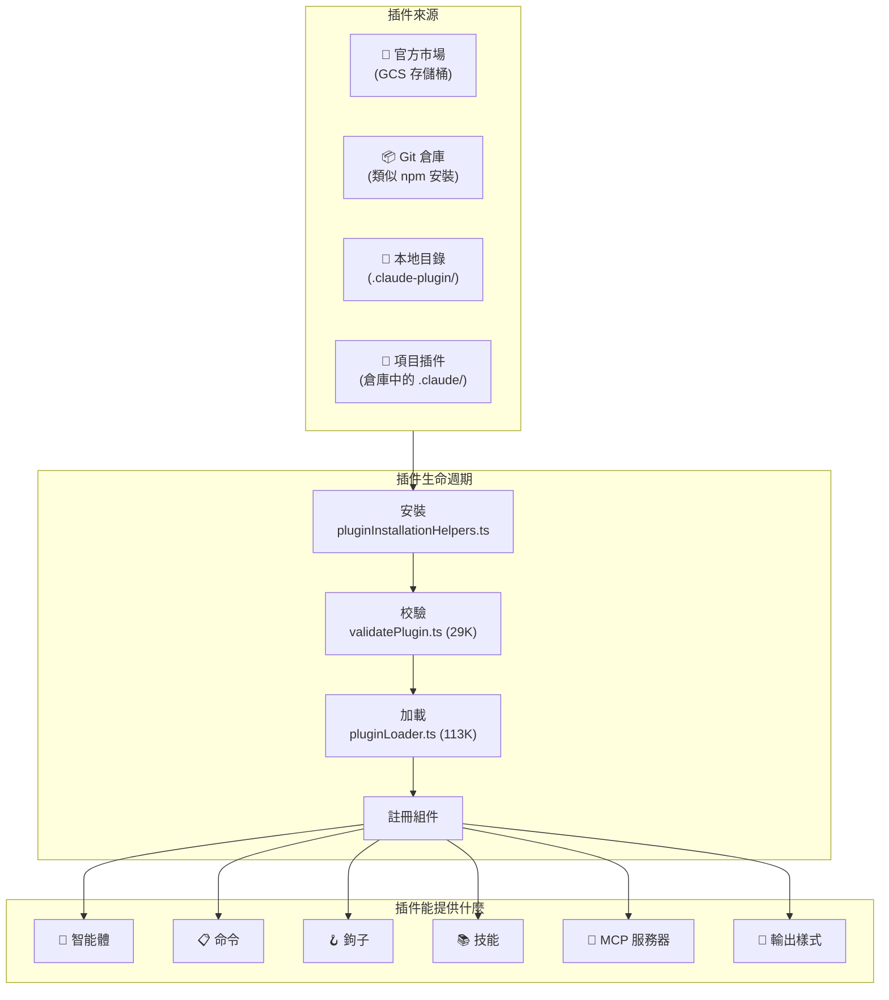

> 🌐 **語言**: [English →](../04-plugin-system.md) | 中文

# 插件系統：44 個文件，全生命週期管理

> **源文件**：`utils/plugins/` (44 個文件, 18,856 行), `components/ManagePlugins.tsx` (2,089 行)

## 太長不看，一句話總結

Claude Code 在底層隱藏了一個完整的插件生態系統 —— 包括插件市場、依賴解析、自動更新、黑名單、ZIP 緩存和熱重載。它比官方文檔所暗示的要複雜得多。單單是插件加載器 (`pluginLoader.ts`) 就有 113K 字節 —— 比大多數完整的 npm 包還要大。

---

## 1. 插件架構概覽



---

## 2. 插件清單 (Manifest)

每個插件都必須有一個 `.claude-plugin/plugin.json` 清單：

```typescript
// 來自 schemas.ts (60K —— 代碼庫中最大的 schema 文件)
{
  "name": "my-plugin",
  "description": "這個插件做什麼的描述",
  "version": "1.0.0",
  "commands": ["commands/*.md"],
  "agents": ["agents/*.md"],
  "hooks": { ... },
  "mcpServers": { ... },
  "skills": ["skills/*/SKILL.md"],
  "outputStyle": "styles/custom.md"
}
```

`schemas.ts` 中的 Schema 校驗代碼長達 **60,595 字節** —— 比大多數完整的插件還要大。它會校驗從命令行 Frontmatter 到 MCP 服務器配置的一切內容。

---

## 3. 插件系統核心文件

| 文件 | 大小 | 用途 |
|------|------|---------|
| **`pluginLoader.ts`** | **113K** | 核心加載器 —— 發現、讀取、校驗並註冊所有插件 |
| **`marketplaceManager.ts`** | **96K** | 插件市場瀏覽、搜索及從官方目錄安裝 |
| **`schemas.ts`** | **61K** | 適用於所有插件清單格式的 Zod 校驗 Schema |
| **`installedPluginsManager.ts`** | **43K** | 管理已安裝插件的狀態、啟用和停用 |
| **`loadPluginCommands.ts`** | **31K** | 解析帶有 YAML Frontmatter 的 Markdown 命令文件 |
| **`mcpbHandler.ts`** | **32K** | 橋接處理器，用於處理插件提供的 MCP 服務器 |
| **`validatePlugin.ts`** | **29K** | 插件啟用前的多重校驗 |
| **`pluginInstallationHelpers.ts`** | **21K** | Git 克隆、npm 安裝、依賴解析 |
| **`mcpPluginIntegration.ts`** | **21K** | 將插件聲明的 MCP 服務器集成到工具池中 |
| **`marketplaceHelpers.ts`** | **19K** | 市場操作的輔助函數 |
| **`dependencyResolver.ts`** | **12K** | 解析插件的依賴圖 |
| **`zipCache.ts`** | **14K** | 將下載的插件緩存為 ZIP 文件以便離線使用 |

---

## 4. 插件生命週期

### 4.1 發現
插件從多個位置被發現，優先級依次為：
1. **內置插件** —— 與二進制文件捆綁在一起。
2. **項目插件** —— 項目中的 `.claude/` 目錄。
3. **用戶插件** —— `~/.config/claude-code/plugins/` 目錄。
4. **市場插件** —— 官方的 GCS 存儲桶目錄。

### 4.2 安裝

從解析市場輸入到解析依賴，再到克隆/下載 ZIP，最終落庫到 `installedPlugins.json`，形成了一條嚴密的安裝鏈路。

### 4.3 校驗

`validatePlugin.ts` (29K) 會執行廣泛的檢查：
- 清單 Schema 校驗 (Zod)
- 命令文件語法校驗
- 鉤子命令安全性檢查
- MCP 服務器配置校驗
- 循環依賴檢測
- 版本兼容性檢查

### 4.4 加載

作為代碼庫中第二大的文件，`pluginLoader.ts` (113K) 處理：
- 並行加載所有插件組件
- 鉤子註冊與智能體定義合併
- 帶有去重功能的命令註冊
- 啟動 MCP 服務器並註冊技能目錄
- **錯誤隔離**（一個插件崩潰不會影響其他插件）

---

## 5. 市場系統

### 官方市場 
市場是一個服務於插件目錄的 GCS (Google Cloud Storage) 存儲桶。它包含：
- **啟動檢查**：在啟動時檢查插件更新。
- **自動更新**：後臺的自動更新機制。
- **黑名單**：可遠程禁用被攻破或違規的插件。
- **安裝統計**：用於評估市場受歡迎程度的監控。

### ZIP 緩存系統
下載的插件被緩存為 ZIP 文件，以避免重複下載，並支持離線使用。使用內容哈希作為鍵，實現跨版本和用戶的去重。

---

## 6. 插件能提供什麼

- **智能體 (Agents)**：通過 Markdown 文件定義，可作為子智能體調用。
- **命令 (Commands)**：通過帶有 YAML Frontmatter 的 Markdown 定義斜槓命令（例如 `/review-pr`）。
- **鉤子 (Hooks)**：註冊生命週期事件（PreToolUse / PostToolUse）。
- **MCP 服務器**：聲明自動啟動的外部資源和工具服務器。
- **技能 (Skills)**：自動發現帶有匹配模式的技能。
- **輸出樣式 (Styles)**：定製化輸出格式（例如講解模式、學習模式）。

---

## 7. 安全與信任模型

- **插件策略**：來自不受信任來源的插件需要用戶明確批准。官方市場的“受管（Managed）”插件享有更高的信任級別。
- **黑名單**：遠程黑名單可通過 ID 停用插件，每次啟動和加載插件時都會檢查。
- **孤兒插件過濾**：檢測並攔截源倉庫已被刪除的插件，防止懸空引用。

---

## 8. Skill 系統架構

**源碼座標**: `src/skills/`、`src/commands/`

Skill 是 Claude Code 的"提示即代碼"系統 —— 每個 Skill 都是一個帶 YAML frontmatter 的 Markdown 文件，定義了能力何時以及如何被激活。

### 8.1 六層來源

```typescript
export type LoadedFrom =
  | 'commands_DEPRECATED'  // 遺留 commands/ 目錄（遷移路徑）
  | 'skills'               // .claude/skills/ 目錄
  | 'plugin'               // 通過插件安裝
  | 'managed'              // 企業管控配置
  | 'bundled'              // CLI 內置 Skill
  | 'mcp'                  // 運行時從 MCP 服務器發現
```

### 8.2 Skill Frontmatter

每個 Skill 通過 YAML frontmatter 解析，支持以下字段：`displayName`、`description`、`allowedTools`（限制可用工具）、`whenToUse`（模型觸發條件）、`executionContext`（`fork` = 隔離執行）、`agent`（綁定到特定代理類型）、`effort`（推理力度等級）等。

### 8.3 內置 Skill 註冊

啟動時程序化註冊：`/update-config`、`/keybindings`、`/verify`、`/debug`、`/simplify`、`/batch`、`/stuck`。功能門控的特殊 Skill：`/loop`（需 `AGENT_TRIGGERS`）、`/claude-api`（需 `BUILDING_CLAUDE_APPS`）。

### 8.4 Inline vs Fork 執行上下文

| 上下文 | 行為 | 用例 |
|--------|------|------|
| **inline** | 注入提示到當前對話 | 簡單命令、配置變更 |
| **fork** | 在隔離子代理中運行，獨立 token 預算 | 複雜任務、多步操作 |

Fork 執行創建獨立查詢循環和消息歷史，防止 Skill 執行汙染主對話上下文。

### 8.5 Token 預算管理

Skill 列表佔用約 1% 的上下文窗口。三級降級策略：1) 嘗試完整描述；2) 超預算時內置 Skill 保留完整描述，其他截斷；3) 極端情況僅顯示名稱。

### 8.6 內置 Skill 文件安全

使用 `O_NOFOLLOW | O_EXCL` 防止符號鏈接攻擊，路徑遍歷驗證阻止 `..` 逃逸。

---

## 9. 內置插件註冊

**源碼座標**: `src/plugins/`

每個內置插件是 skills + hooks + MCP 服務器的**三元組**。`isAvailable` 函數支持環境感知激活（如 JetBrains 專用插件僅在檢測到 JetBrains IDE 時激活）。

啟用/禁用邏輯：顯式用戶設置 > `defaultEnabled` > 默認啟用。

插件提供的 Skill 自動轉換為斜槓命令：`getBuiltinPluginSkillCommands()` 遍歷所有已啟用插件，調用 `skillDefinitionToCommand()` 生成 Command 對象。

---

## 10. MCP 集成深化

**源碼座標**: `src/services/mcp/client.ts`

### 六種傳輸類型

| 傳輸 | 協議 | 用例 |
|------|------|------|
| `stdio` | stdin/stdout | 本地 CLI 工具 |
| `sse` | Server-Sent Events | 遠程 HTTP 服務器 |
| `http` | HTTP POST（可流式） | 無狀態 API 服務器 |
| `ws` | WebSocket | 雙向流式 |
| `sdk` | 進程內 SDK | 同進程工具 |
| `sse-ide` | SSE 通過 IDE 代理 | IDE 橋接服務器 |

### 工具發現 → 工具對象轉換

MCP 工具命名規則：`mcp__{serverName}__{toolName}`，自動注入 `assembleToolPool()` 中並保持穩定排序。

---

## 11. 後臺安裝管理器

**源碼座標**: `src/utils/plugins/pluginInstallationManager.ts`

採用**聲明式協調模型**：不是命令式的"安裝這個"，而是聲明"這些插件應該存在"，管理器處理差異（安裝缺失、清理多餘、更新過期）。

關鍵設計：
- 每個安裝步驟發射進度事件，被 ManagePlugins UI 消費
- 一個插件安裝失敗不阻塞其他插件

---

## 可遷移設計模式

> 以下來自插件系統的模式可直接應用於任何可擴展應用架構。

### 模式 1：默認隔離
每個插件隔離加載，一個崩潰不影響其他。

### 模式 2：帶優先級的多源發現
項目級別的插件覆蓋用戶級別。

### 模式 3：內容尋址緩存
ZIP 緩存使用內容哈希作為鍵，支持跨版本去重。

### 模式 4：提示即代碼 (Skills)
Markdown + YAML frontmatter = 可版本控制、可共享、可組合的能力。

### 模式 5：聲明式協調
`PluginInstallationManager` 借鑑 Kubernetes Operator 的"期望狀態 → 實際狀態 → 差異 → 協調"模型，比命令式安裝/卸載序列更健壯。

---

## 總結

| 維度 | 細節 |
|--------|--------|
| **總代碼量** | 僅 `utils/plugins/` 目錄下就包含 44 個文件，18,856 行 |
| **最大文件** | `pluginLoader.ts` (113K), `marketplaceManager.ts` (96K) |
| **插件來源** | 內置、項目內、用戶配置、官方市場 (GCS) |
| **提供組件** | 智能體、命令、鉤子、技能、MCP 服務器、輸出樣式 |
| **市場機制** | GCS 存儲桶目錄、自動更新、黑名單、安裝統計 |
| **安全機制** | 工作區信任、強制校驗、遠程黑名單、孤兒檢測 |
