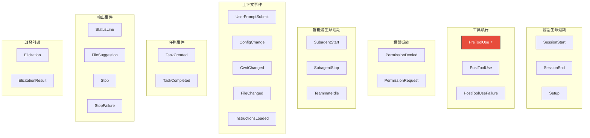

> 🌐 **語言**: [English →](../05-hook-system.md) | 中文

# 鉤子系統 (Hook System)：20 種事件類型，全生命週期攔截

> **源文件**：`utils/hooks.ts` (5,023 行), `utils/hooks/` 目錄, `hooks/` 頂層目錄 (17,931 行)

## 太長不看，一句話總結

Claude Code 擁有一個包含 20 種事件的鉤子系統，允許用戶和插件攔截幾乎每一個動作 —— 從工具執行、會話生命週期到權限決策。鉤子可以批准、拒絕、修改輸入、注入上下文或停止整個會話。核心實現文件 (`hooks.ts`) 長達 **5,023 行** —— 這比許多完整的應用程序還要龐大。

---

## 1. 20 種鉤子事件



### 最重要的鉤子：PreToolUse (工具使用前)

`PreToolUse` 在每次工具執行前觸發。它可以：

| 動作 | JSON 輸出形式 | 效果 |
|--------|-------------|--------|
| **允許** | `{ "permissionDecision": "allow" }` | 跳過權限提示，自動批准 |
| **拒絕** | `{ "permissionDecision": "deny" }` | 攔截工具，向模型返回錯誤 |
| **詢問** | `{ "permissionDecision": "ask" }` | 強制彈出用戶權限確認提示 |
| **修改輸入** | `{ "updatedInput": {...} }` | 在執行前篡改工具參數 |
| **停止會話** | `{ "continue": false }` | 徹底叫停智能體循環 |

---

## 2. 鉤子的執行架構

### 鉤子類型

鉤子可以通過四種方式實現：
1. **指令型 (Command)**：執行 shell 腳本（如 `python validate.py`）。
2. **HTTP 型**：發送 Webhook 請求到指定端點。
3. **智能體型 (Agent)**：調用另一個 Claude 子智能體作為審核者。
4. **函數型 (Function)**：僅在 SDK 模式下可用的進程內 JavaScript 回調。

### 執行流程

1. 當發起工具使用請求時，引擎通過事件和工具名稱匹配觸發對應的鉤子。
2. 鉤子通過 stdin/POST/Prompt 接收含有上下文的 JSON 載荷。
3. 如果鉤子返回合法的 JSON，引擎會對其解析並用於決定系統的行動（如修改輸入或攔截）。
4. 如果鉤子僅返回純文本，它將被視作一條附加信息（Message attachment）。
5. **約定的退出碼**：0 表示成功；1 表示非阻塞錯誤；**2 表示阻塞錯誤，將強行終止工具運行**。

---

## 3. 鉤子的匹配機制

鉤子在配置文件中聲明其攔截領域：
```json
// 源碼位置: src/utils/hooks.ts:156-170
{
  "hooks": {
    "PreToolUse": [
      {
        "matcher": "Bash(git *)",
        "command": "python validate_git.py"
      }
    ]
  }
}
```
匹配器 (matcher) 支持指定工具名（如 `Bash`），支持模式匹配（如 `Bash(git *)` 控制僅限 git 命令），甚至支持通配符 `*` 攔截所有工具。

對於權限匹配，系統採用了“閉包注入”模式，避免了每次匹配時重複解析工具輸入。

---

## 4. JSON 協議機制

鉤子通信依賴結構化的 JSON。
從系統傳入鉤子的 `stdin` 會包含 `session_id`、當前路徑 `cwd`、工具名及輸入的參數。
鉤子輸出的 `stdout` 除了包含 `continue` 和 `decision` 字段外，還可以利用 `hookSpecificOutput` 進行細粒度控制（例如注入系統消息，或篡改即將執行的命令）。為了系統穩定，輸出結果會經過 Zod 的嚴格模式校驗。

---

## 5. 工作區信任的安全性控制

**這是一個關鍵的安全防禦點**：防止位於不受信任工作區的惡意代碼執行權限篡改。
在交互式運行下（即 CLI 環境），只有當用戶接受了工作區信任彈窗（`checkHasTrustDialogAccepted()` 為 true），鉤子才被允許運行。這消除了通過 `.claude/settings.json` 隱藏後門執行任意代碼的攻擊載體。

---

## 6. background異步鉤子與喚醒

鉤子不僅可以同步攔截，還可以配置為**background異步執行**：
當鉤子返回 `{ "async": true, "asyncRewake": true }` 時，它將被掛起在background運行。即使模型當前正在處理其他任務，當異步鉤子完成時，它可以通過產生 `task-notification` 消息重新喚醒（Re-wake）模型，把數據強行注入到對話流中。

---

## 7. 鉤子聚合策略 (Hook Aggregation)

當多個鉤子同時匹配到同一個事件時，其結果會按特定策略聚合：
- **拒絕優先**：“Deny” 的權重大於“Allow”（最嚴限制勝出）。
- **截斷策略**：任何一個鉤子包含 `preventContinuation` 就會導致對話中途停止。
- **最新覆蓋**：多個鉤子均嘗試修改輸入（`updatedInput`）時，最後一個生效。
- **上下文合併**：多條注入內容會被拼接。

這意味著某一個安全審核插件可以否決其他所有插件的寬鬆決定。

---

## 可遷移設計模式

> 以下模式可直接應用於其他 Agentic 系統或 CLI 工具。

### 模式 1：以退出碼 (Exit Code) 作為控制流
對於跨語言調用的腳本系統來說，利用退出碼（0/1/2）來區分“成功”、“警告”和“強硬攔截”是一種極簡且普適的通信協議，無需特定的 SDK 支持。

### 模式 2：JSON 與文本的降級包容性
系統允許鉤子返回嚴格的 JSON，也允許只返回一段隨意的文本。JSON 會被用於邏輯控制，文本會被用作簡單的日誌附件。這種設計極大地降低了開發簡單提示器（Hook）的門檻，同時不失對複雜控制能力的支持。

### 模式 3：匹配器閉包預編譯
系統預先編譯帶有校驗邏輯的閉包，避免了每次命中鉤子時都要完整走一遍正則表達式或 AST 解析過程，優化了性能。

---

## 9. 總結

| 維度 | 細節 |
|--------|--------|
| **總代碼量** | `hooks.ts` 中含 5,023 行，`hooks/` 目錄含 17,931 行 |
| **事件種類** | 20 個生命週期鉤子事件 |
| **觸發方式** | Shell 命令行、Webhook HTTP、子智能體代理、JS 回調（SDK） |
| **關鍵攔截點** | `PreToolUse` —— 能審核、拒絕或篡改任何工具調用 |
| **安全機制** | 強制要求工作區信任 (Workspace Trust) |
| **異步流** | 支持background執行，以及回調型模型喚醒 |
| **衝突聚合** | 按照“最嚴苛限制優先（Deny > Allow）”和覆蓋原則合併結果 |
