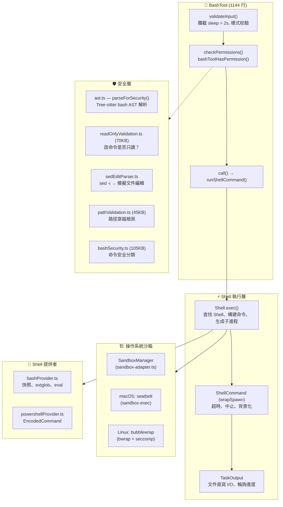
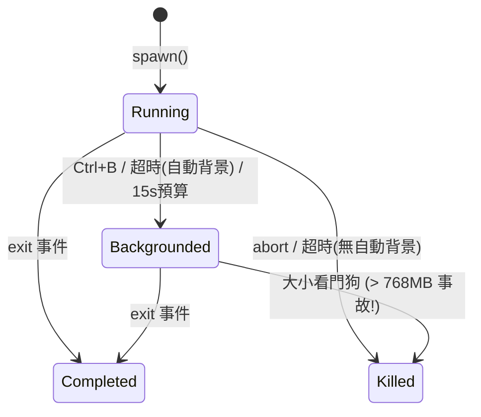
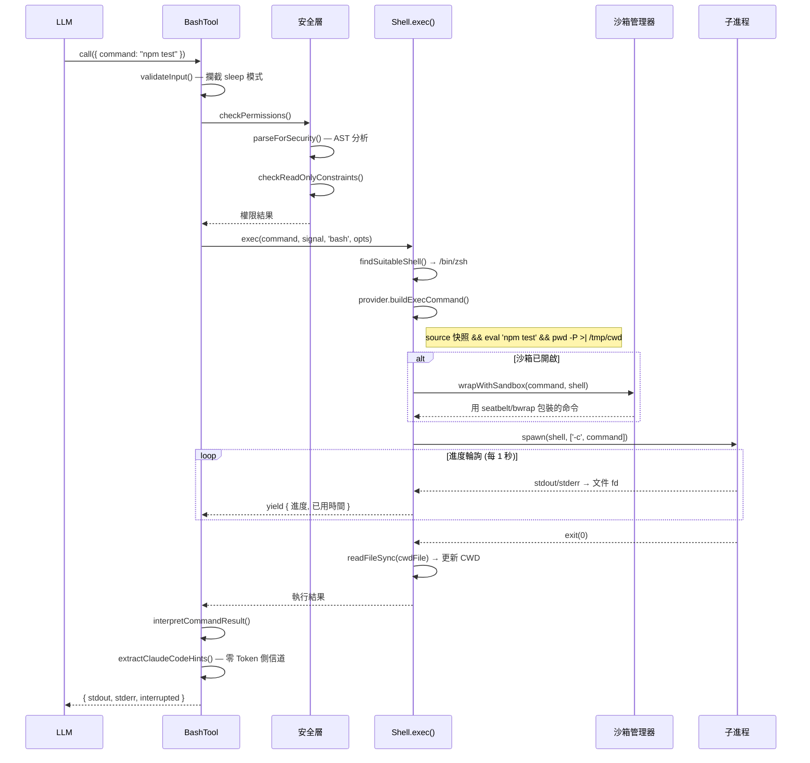

# 06 — Bash 執行引擎：沙箱、管道與進程生命週期

> **範圍**: `tools/BashTool/` (18 個文件, ~580KB), `utils/Shell.ts`, `utils/ShellCommand.ts`, `utils/bash/` (15 個文件, ~430KB), `utils/sandbox/` (2 個文件, ~37KB), `utils/shell/` (10 個文件, ~114KB)
>
> **一句話概括**: Claude Code 如何安全地執行任意 Shell 命令 —— 從解析 `ls && rm -rf /` 到操作系統級沙箱 —— 全程不慌不忙。

---

## 架構概覽



---

## 1. BashTool：外殼（雙關語）

入口點是 `BashTool.tsx` —— 一個 1144 行的工具定義，使用標準的 `buildTool()` 模式構建。輸入模式看似簡單：

```typescript
// 源碼位置: src/tools/BashTool/BashTool.tsx:45-54
z.strictObject({
  command: z.string(),
  timeout: semanticNumber(z.number().optional()),
  description: z.string().optional(),
  run_in_background: semanticBoolean(z.boolean().optional()),
  dangerouslyDisableSandbox: semanticBoolean(z.boolean().optional()),
  _simulatedSedEdit: z.object({...}).optional()  // 對模型隱藏
})
```

### 隱藏的 `_simulatedSedEdit` 字段

這是一個安全關鍵的設計：`_simulatedSedEdit` **始終從模型可見的 schema 中移除**。它僅在用戶通過權限對話框批准 sed 編輯預覽後內部設置。如果暴露給模型，模型就能通過將一個無害命令與任意文件寫入配對來繞過權限檢查。

### 命令分類

在任何命令運行之前，BashTool 會對其進行 UI 分類：

- **搜索命令** (`find`, `grep`, `rg` 等) → 可摺疊顯示
- **讀取命令** (`cat`, `head`, `tail`, `jq`, `awk` 等) → 可摺疊顯示
- **語義中性命令** (`echo`, `printf`, `true` 等) → 分類時跳過
- **靜默命令** (`mv`, `cp`, `rm`, `mkdir` 等) → 顯示 "Done" 而非 "(No output)"

對於複合命令（`ls && echo "---" && ls dir2`），**所有**部分都必須是搜索/讀取操作，整個命令才會被摺疊。語義中性命令是透明的。

---

## 2. `runShellCommand()` 生成器

執行的核心是一個 **AsyncGenerator** —— 一種優雅地將進度報告與命令完成統一起來的設計：

```typescript
// 源碼位置: src/tools/BashTool/BashTool.tsx:200-280
async function* runShellCommand({...}): AsyncGenerator<進度, 結果, void> {
  // 1. 判斷是否允許自動背景化
  // 2. 通過 Shell.exec() 執行
  // 3. 等待初始閾值（2秒）後才顯示進度
  // 4. 由共享輪詢器驅動的進度循環
  while (true) {
    const result = await Promise.race([結果Promise, 進度信號])
    if (result !== null) return result
    if (已背景化) return 背景化結果
    yield { type: 'progress', output, elapsedTimeSeconds, ... }
  }
}
```

### 三條背景化路徑

| 路徑 | 觸發條件 | 決策者 |
|------|---------|--------|
| **顯式** | `run_in_background: true` | 模型 |
| **超時** | 命令超過默認超時時間 | `shellCommand.onTimeout()` |
| **助手模式** | 主代理中阻塞 > 15 秒 | `setTimeout()` + 15秒預算 |
| **用戶** | 執行期間按 Ctrl+B | `registerForeground()` → `background()` |

`sleep` 命令被特別禁止自動背景化 —— 除非顯式請求，否則在 foreground 運行。

---

## 3. Shell 執行層 (`Shell.ts`)

### Shell 發現

Claude Code 對支持哪些 Shell 有明確立場：

```typescript
// 1. 檢查 CLAUDE_CODE_SHELL 覆蓋（必須是 bash 或 zsh）
// 2. 檢查 $SHELL（必須是 bash 或 zsh）
// 3. 探測：which zsh, which bash
// 4. 搜索備用路徑：/bin, /usr/bin, /usr/local/bin, /opt/homebrew/bin
```

**僅支持 bash 和 zsh**。Fish、dash、csh —— 全部拒絕。

### 進程生成：文件模式 vs. 管道模式

一個關鍵的架構決策驅動 I/O 性能：

**文件模式（bash 命令默認）**：stdout 和 stderr **共用同一個文件描述符**。這意味著 stderr 與 stdout 按時間順序交錯 —— 沒有單獨的 stderr 處理。

關於原子性保證：
- **POSIX**: `O_APPEND` 使每次寫入原子化（尋址到末尾 + 寫入）
- **Windows**: 使用 `'w'` 模式，因為 `'a'` 會剝離 `FILE_WRITE_DATA`，導致 MSYS2/Cygwin 靜默丟棄所有輸出
- **安全性**: `O_NOFOLLOW` 防止符號鏈接攻擊

**管道模式（用於鉤子/回調）**：使用 StreamWrapper 實例將數據導入 TaskOutput。

### CWD 跟蹤

每個命令以 `pwd -P >| /tmp/claude-XXXX-cwd` 結尾。子進程退出後，使用**同步** `readFileSync` 更新 CWD。NFC 規範化處理 macOS APFS 的 NFD 路徑存儲問題。

---

## 4. ShellCommand：進程包裝器



### 大小看門狗

背景任務直接寫入文件描述符，**沒有 JS 參與**。一個卡住的追加循環曾經填滿了 768GB 的磁盤。修復方案：每 5 秒輪詢文件大小，超過限制時 `SIGKILL` 終止整個進程樹。

### 為什麼用 `exit` 而非 `close`

代碼使用 `'exit'` 而非 `'close'` 來檢測子進程終止：`close` 會等待 stdio 關閉，包括繼承了文件描述符的孫進程（如 `sleep 30 &`）。`exit` 在 Shell 本身退出時立即觸發。

---

## 5. Bash 提供者：命令組裝流水線

`bashProvider.ts` 構建傳遞給 Shell 的實際命令字符串：

```
source /tmp/snapshot.sh 2>/dev/null || true
&& eval '<引號包裹的用戶命令>'
&& pwd -P >| /tmp/claude-XXXX-cwd
```

### Shell 快照

首次命令前，`createAndSaveSnapshot()` 將用戶的 Shell 環境（PATH、別名、函數）捕獲到臨時文件。後續命令 `source` 此快照，而非運行完整的登錄 Shell 初始化（跳過 `-l` 標誌）。

### ExtGlob 安全

每個命令前都**禁用**擴展 glob 模式：惡意文件名中的 glob 模式可能在安全驗證*之後*但執行*之前*展開。

### `eval` 包裝器

用戶命令被包裹在 `eval '<command>'` 中，使別名（從快照加載）能在第二次解析時被展開。

---

## 6. 操作系統級沙箱

`sandbox-adapter.ts`（986 行）橋接 Claude Code 的設置系統與 `@anthropic-ai/sandbox-runtime`：

### 平臺支持

| 平臺 | 技術 | 說明 |
|------|------|------|
| **macOS** | `sandbox-exec` (seatbelt) | 基於配置文件，支持 glob |
| **Linux** | `bubblewrap` (bwrap) + seccomp | 命名空間隔離，**不支持 glob** |
| **WSL2** | bubblewrap | 支持 |
| **WSL1** | ❌ | 不支持 |
| **Windows** | ❌ | 不支持 |

### 安全：設置文件保護

沙箱**無條件拒絕寫入**設置文件 —— 防止沙箱內的命令修改自己的沙箱規則，這是經典的沙箱逃逸向量。

### 裸 Git 倉庫攻擊

一個精妙的安全措施阻止瞭如下攻擊：沙箱內的進程植入文件（`HEAD`、`objects/`、`refs/`）使工作目錄看起來像一個裸 git 倉庫。當 Claude 的*非沙箱* git 後續運行時，`is_git_directory()` 返回 true，而惡意的 `config` 中的 `core.fsmonitor` 就能逃逸沙箱。

防禦方案：
- 已存在的文件 → 拒絕寫入（只讀綁定掛載）
- 不存在的文件 → 命令執行後立即清掃（刪除任何被植入的文件）

---

## 7. 完整執行流程



---

## 可遷移設計模式

> 以下模式可直接應用於其他 CLI 工具或進程編排系統。

### 模式 1：stdout/stderr 合併到單一 fd
**場景：** 併發寫入的 stdout 和 stderr 到達順序混亂。
**實踐：** 將兩者導入同一個文件描述符，配合 `O_APPEND` 保證每次寫入的原子性。
**Claude Code 中的應用：** `spawn(shell, args, { stdio: ['pipe', outputHandle.fd, outputHandle.fd] })`。

### 模式 2：零 Token 側信道
**場景：** CLI 工具需要傳遞元數據（提示、插件建議）但不能膨脹 LLM 上下文窗口。
**實踐：** 向 stderr 發出結構化標籤，掃描後剝離再傳給模型。
**Claude Code 中的應用：** `<claude-code-hint />` 標籤被 `extractClaudeCodeHints()` 提取後剝離，模型永遠看不到。

### 模式 3：AsyncGenerator 進度報告
**場景：** 長時間運行的子進程需要增量報告進度，同時最終交付結果。
**實踐：** 使用 AsyncGenerator——`yield` 產生進度更新，`return` 交付最終結果。消費者用 `Promise.race([結果Promise, 進度信號])` 在單個 await 中同時處理兩者。
**Claude Code 中的應用：** `runShellCommand()` 每秒 yield 進度，命令完成時 return `ExecResult`。

---

## 9. 組件總結

| 組件 | 行數 | 角色 |
|------|------|------|
| `BashTool.tsx` | 1,144 | 工具定義、輸入/輸出模式、分類 |
| `bashPermissions.ts` | ~2,500 | 帶通配符的權限匹配 |
| `bashSecurity.ts` | ~2,600 | 命令安全分類 |
| `readOnlyValidation.ts` | ~1,700 | 只讀約束檢查 |
| `pathValidation.ts` | ~1,100 | 路徑穿越和逃逸檢測 |
| `Shell.ts` | 475 | Shell 發現、進程生成、CWD 跟蹤 |
| `ShellCommand.ts` | 466 | 進程生命週期、背景化、超時 |
| `sandbox-adapter.ts` | 986 | 設置轉換、OS 沙箱編排 |
| `bashProvider.ts` | 256 | 命令組裝、快照、eval 包裝 |
| `bash/` 解析器 | ~7,000+ | AST 解析、heredoc、引號、管道處理 |

Bash 執行引擎是 Claude Code 最安全敏感的子系統。它展示了**縱深防禦**策略：應用層命令解析 → 權限規則 → 沙箱包裝 → 操作系統內核級強制執行。每一層獨立防止不同類別的攻擊，當個別層不可用時系統也能優雅降級。

---

**下一篇**: [07 — 權限流水線 →](07-permission-pipeline.md)

**上一篇**: [← 05 — 鉤子系統](05-hook-system.md)
