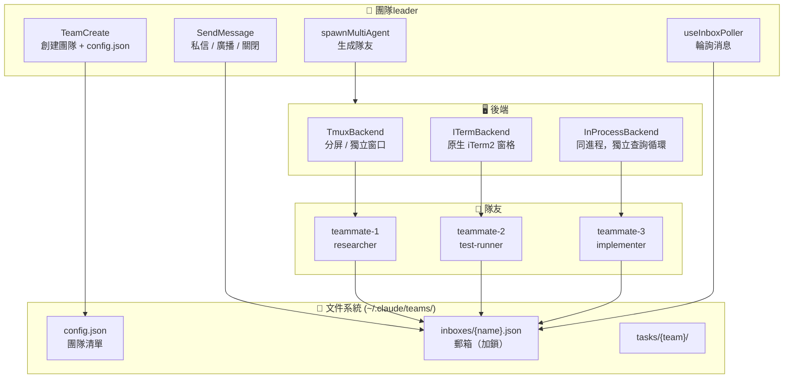

# 08 — Swarm 智能體：多智能體團隊協調

> **範圍**: `tools/TeamCreateTool/`、`tools/SendMessageTool/`、`tools/shared/spawnMultiAgent.ts`、`utils/swarm/`（~30 個文件，~6.8 千行）、`utils/teammateMailbox.ts`（1,184 行）
>
> **一句話概括**: Claude Code 如何在 tmux 窗格、iTerm2 分屏或進程內生成並行隊友 —— 全部通過基於文件的郵箱系統配合鎖文件併發控制進行協調。

---

## 架構概覽



---

## 1. 團隊生命週期

### 創建團隊

`TeamCreateTool` 初始化團隊基礎設施：

1. 生成唯一團隊名（衝突時使用隨機詞組合）
2. 創建團隊leader條目，確定性 agent ID：`team-lead@{teamName}`
3. 將 `config.json` 寫入 `~/.claude/teams/{team-name}/`
4. 註冊會話清理（退出時自動刪除，除非已顯式刪除）
5. 重置任務列表目錄，從編號 1 開始

### 生成隊友

`spawnMultiAgent.ts`（1,094 行）處理完整的生成流程：

1. **解析模型**：`inherit` → leader的模型；`undefined` → 硬編碼回退
2. **生成唯一名稱**：檢查現有成員，追加 `-2`、`-3` 等
3. **檢測後端**：tmux > iTerm2 > 進程內（見 §3）
4. **創建窗格/進程**：後端特定的生成邏輯
5. **構建 CLI 參數**：傳播 `--agent-id`、`--team-name`、`--agent-color`、`--permission-mode`
6. **註冊到團隊文件**：將成員條目添加到 `config.json`
7. **發送初始消息**：將提示詞寫入隊友的郵箱
8. **註冊背景任務**：用於 UI 任務標識顯示

---

## 2. 郵箱系統

智能體間通信的骨幹是**基於文件的郵箱**，配合鎖文件併發控制。

### 目錄結構

```
~/.claude/teams/{team-name}/
├── config.json              # 團隊清單
└── inboxes/
    ├── team-lead.json       # leader的收件箱
    ├── researcher.json      # 隊友收件箱
    └── test-runner.json     # 隊友收件箱
```

### 消息類型

| 類型 | 方向 | 用途 |
|------|------|------|
| 純文本私信 | 任意 → 任意 | 直接消息 |
| 廣播（`to: "*"`） | leader → 全體 | 團隊公告 |
| `idle_notification` | worker → leader | "我完成了/被阻塞了/失敗了" |
| `permission_request` | worker → leader | 工具權限委託 |
| `permission_response` | leader → worker | 權限授予/拒絕 |
| `sandbox_permission_request` | worker → leader | 網絡訪問審批 |
| `plan_approval_request` | worker → leader | 計劃審查（planModeRequired） |
| `shutdown_request` | leader → worker | 優雅關閉 |
| `shutdown_approved/rejected` | worker → leader | 關閉確認 |

### 併發控制

多個 Claude 實例可以併發寫入 —— 鎖文件通過指數退避重試（10 次重試，5-100ms 超時）序列化訪問。

---

## 3. 後端檢測與執行

三種後端決定隊友的物理運行方式：

| 特性 | Tmux | iTerm2 | 進程內 |
|------|------|--------|--------|
| 隔離性 | 獨立進程 | 獨立進程 | 同進程，獨立查詢循環 |
| UI 可見性 | 帶彩色邊框的窗格 | 原生 iTerm2 窗格 | 背景任務標識 |
| 前置條件 | tmux 已安裝 | `it2` CLI 已安裝 | 無 |
| 非交互模式（`-p`） | ❌ | ❌ | ✅（強制） |
| Socket 隔離 | PID 作用域：`claude-swarm-{pid}` | N/A | N/A |

檢測優先級：**tmux 內部 → iTerm2 原生 → tmux 外部 → 進程內回退**。

---

## 4. 權限委託

隊友沒有交互終端 —— 它們將權限決策委託給leader：

1. worker需要權限 → 創建 `permission_request` 消息
2. 寫入leader的郵箱
3. leader的 `useInboxPoller` 拾取請求
4. leader向用戶顯示權限提示
5. leader發送 `permission_response` 回worker的郵箱
6. worker輪詢收件箱，獲取響應，繼續或中止

### Plan Mode Required

帶 `plan_mode_required: true` 生成的隊友：
- 必須進入 plan 模式並創建計劃
- 計劃作為 `plan_approval_request` 發送給leader
- leader審核後發送 `plan_approval_response`
- 批准時，leader的權限模式被繼承（`plan` 映射為 `default`）

---

## 5. 智能體身份系統

```
格式：{name}@{teamName}
示例：researcher@my-project、team-lead@my-project
```

### CLI 標誌傳播

生成隊友時，leader傳播以下標誌：

| 標誌 | 條件 | 用途 |
|------|------|------|
| `--dangerously-skip-permissions` | bypass 模式 + 非 planModeRequired | 繼承權限繞過 |
| `--permission-mode auto` | auto 模式 | 繼承分類器 |
| `--model {model}` | 顯式模型覆蓋 | 使用leader的模型 |
| `--settings {path}` | CLI 設置路徑 | 共享設置 |
| `--plugin-dir {dir}` | 內聯插件 | 共享插件 |
| `--parent-session-id {id}` | 始終 | 血統追蹤 |

---

## 6. 團隊清理

### 優雅關閉

`SendMessage(type: shutdown_request)` → 隊友回應 `shutdown_approved/rejected`：
- **批准**：進程內隊友中止查詢循環；窗格隊友調用 `gracefulShutdown(0)`
- **拒絕**：隊友提供原因，繼續工作

### 會話清理

`cleanupSessionTeams()` 在leader退出時運行：
1. 終止孤立的隊友窗格
2. 刪除團隊目錄：`~/.claude/teams/{team-name}/`
3. 刪除任務目錄：`~/.claude/tasks/{team-name}/`
4. 銷燬為隔離隊友創建的 git worktree

---

## 可遷移設計模式

> 以下來自 Swarm 系統的模式可直接應用於任何多智能體或分佈式協調架構。

### 為什麼用文件郵箱？

郵箱系統使用純 JSON 文件 + 鎖文件，而非 IPC、WebSocket 或共享內存：
- **跨進程**：tmux 窗格是獨立進程，沒有共享內存
- **崩潰安全**：消息持久化在磁盤上，即使隊友崩潰也不丟失
- **可調試**：`cat ~/.claude/teams/my-team/inboxes/researcher.json`
- **簡單**：無守護進程，無端口分配，無服務發現

### 一個leader，多個worker

架構強制執行嚴格的leader-worker層級：
- 每個leader會話只能有一個團隊
- worker不能創建團隊或批准自己的計劃
- 關閉始終由leader發起，worker確認
- 權限委託始終是 worker → leader → worker

---

## 8. 協調器模式

**源碼座標**: `src/coordinator/coordinatorMode.ts`

協調器模式將leader從任務分發者轉變為**綜合引擎** —— 它不僅僅是委派工作，還要理解和整合結果。

### 激活：雙重門控

構建時特性標誌 AND 運行時環境變量必須同時啟用。恢復會話時，`matchSessionMode()` 自動翻轉變量以匹配恢復會話的模式。

### 協調器工作流

```
研究（worker，並行）→ 綜合（協調器整合發現）→ 實現（worker，按文件集串行）→ 驗證（worker，並行）
```

核心原則：
- **協調器擁有綜合權** —— 不做"基於你的發現"式委派；協調器必須理解並重述
- **並行是超能力** —— 獨立worker併發運行
- **讀寫隔離** —— 研究任務並行，寫操作按文件集串行

---

## 9. 任務類型聯合（7 種變體）

**源碼座標**: `src/tasks/`

每個背景任務由七種狀態變體之一表示：

```typescript
export type TaskState =
  | LocalShellTaskState         // 本地 shell 命令
  | LocalAgentTaskState         // 通過 AgentTool 的子代理
  | RemoteAgentTaskState        // 遠程 CCR 代理
  | InProcessTeammateTaskState  // 同進程團隊成員
  | LocalWorkflowTaskState      // 本地工作流
  | MonitorMcpTaskState         // MCP 服務器監控
  | DreamTaskState              // 自動記憶整理
```

### 完成通知

代理完成時注入 `<task-notification>` XML，包含 `task-id`、`status`（completed/failed/killed）、`result`（最終文本響應）和 `usage` 統計。因為作為 `user` 類型消息注入，LLM 在對話流中自然處理它。

---

## 10. Agent 間通信協議

**源碼座標**: `src/tools/SendMessageTool/`

### 結構化消息類型

除純文本外，代理可以交換帶類型的控制消息：`shutdown_request`、`shutdown_response`、`plan_approval_response`。

### 消息路由

```
SendMessage(to="researcher", message="...")
  ↓
進程內隊友？ → 直接 pendingMessages
  ↓ 否
本地代理？ → queuePendingMessage → 在工具輪次邊界消費
  ↓ 否
窗格（tmux/iterm2）？ → 文件系統郵箱
  ↓ 否
UDS/Bridge？ → socket/bridge 傳輸
  ↓ 否
"*"（廣播）？ → 遍歷所有團隊成員，逐個發送
```

### 跨會話通信（UDS）

啟用 `feature('UDS_INBOX')` 時，同一機器上的 Claude Code 會話可通過 Unix Domain Socket 通信。消息封裝為 `<cross-session-message>` XML。

---

## 11. DreamTask 與 UltraPlan

### DreamTask：自動記憶整理

DreamTask 運行background代理，審查近期會話歷史並將學習成果整理到 `MEMORY.md`。`priorMtime` 字段充當回滾鎖 —— 如果整理在寫入過程中被終止，系統可以恢復文件到整理前的狀態。

### UltraPlan：編排式遠程執行

UltraPlan 將代理範式擴展到通過 CCR（Claude Code Runner）的遠程執行，實現"先規劃-後執行"的工作流：遠程生成計劃，必須經過用戶審批後才能開始實施。

---

## 組件總結

| 組件 | 行數 | 角色 |
|------|------|------|
| `spawnMultiAgent.ts` | 1,094 | 統一的隊友生成邏輯 |
| `teammateMailbox.ts` | 1,184 | 基於文件的郵箱 + 鎖文件併發 |
| `teamHelpers.ts` | 684 | 團隊文件 CRUD、清理、worktree 管理 |
| `SendMessageTool.ts` | 918 | 私信、廣播、關閉、計劃審批 |
| `TeamCreateTool.ts` | 241 | 團隊初始化 |
| `backends/registry.ts` | 465 | 後端檢測：tmux > iTerm2 > 進程內 |
| `teammateLayoutManager.ts` | ~400 | 窗格創建、顏色分配、邊框狀態 |

Swarm 系統是 Claude Code 操作最複雜的功能 —— 它將進程管理、基於文件的 IPC、終端多路複用和分佈式權限委託融合為一個多智能體框架。文件郵箱設計優先考慮簡單性和可調試性而非性能，這在"分佈式系統"實際上是共享同一文件系統的多個 AI 智能體時是正確的權衡。

---

**上一篇**: [← 07 — 權限流水線](07-permission-pipeline.md)
**下一篇**: [→ 09 — 會話持久化](09-session-persistence.md)
