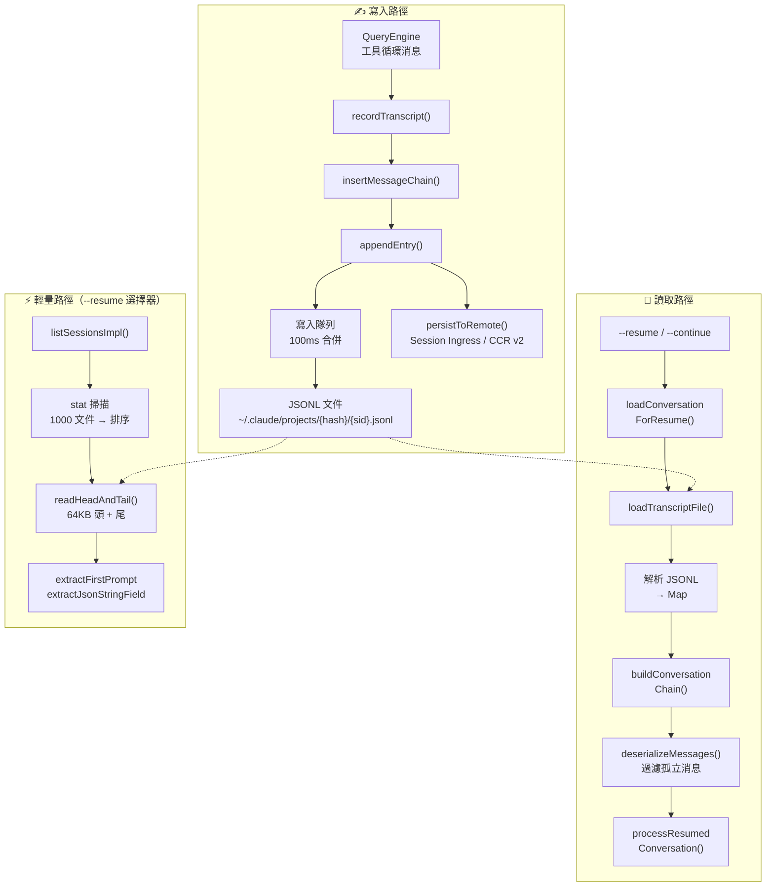

# 09 — 會話持久化：對話存儲與恢復

> **範圍**: `utils/sessionStorage.ts`（5,106 行）、`utils/sessionStoragePortable.ts`（794 行）、`utils/sessionRestore.ts`（552 行）、`utils/conversationRecovery.ts`（598 行）、`utils/listSessionsImpl.ts`（455 行）、`utils/crossProjectResume.ts`（76 行）— 總計約 7,600 行
>
> **一句話概括**: Claude Code 如何將每一輪對話、元數據條目和子智能體轉錄持久化到僅追加的 JSONL 文件中 —— 並在 `--resume` 時通過 parent-UUID 鏈式遍歷重建對話狀態。

---

## 架構概覽



---

## 1. 存儲格式：僅追加 JSONL

每個會話產生一個 JSONL 文件，路徑為：

```
~/.claude/projects/{淨化後的cwd}/{session-id}.jsonl
```

### 路徑淨化

`sanitizePath()` 將所有非字母數字字符替換為短橫線。超過 200 字符的路徑會追加哈希後綴以確保唯一性（Bun 使用 `Bun.hash`，Node 回退到 `djb2Hash`）。

### 條目類型

每一行是一個自包含的 JSON 對象，帶有 `type` 字段：

| 類型 | 用途 |
|------|------|
| `user` / `assistant` / `system` / `attachment` | 轉錄消息（對話鏈） |
| `summary` | 壓縮摘要 |
| `custom-title` / `ai-title` | 會話命名 |
| `last-prompt` | 最近一條用戶提示（用於 `--resume` 選擇器） |
| `tag` | 用戶定義的會話標籤 |
| `agent-name` / `agent-color` / `agent-setting` | 獨立智能體上下文 |
| `mode` | `coordinator` 或 `normal` |
| `worktree-state` | Git worktree 進入/退出追蹤 |
| `pr-link` | GitHub PR 關聯 |
| `file-history-snapshot` | 文件修改歷史追蹤 |
| `attribution-snapshot` | 提交歸因狀態 |
| `content-replacement` | 工具輸出壓縮記錄 |
| `marble-origami-commit` / `marble-origami-snapshot` | 上下文摺疊狀態 |
| `queue-operation` | 消息隊列操作 |

### Parent-UUID 鏈

轉錄消息通過 `parentUuid` → `uuid` 形成鏈表結構：

```
msg-A (parentUuid: null)
  └── msg-B (parentUuid: A)
        └── msg-C (parentUuid: B)
              └── msg-D (parentUuid: C)
```

這種設計支持分支（fork 會話共享鏈前綴）、側鏈（子智能體轉錄）和壓縮邊界（null parentUuid 截斷鏈條）。

---

## 2. Project 單例

`sessionStorage.ts` 的核心是 `Project` 類 —— 一個進程生命週期的單例，管理所有寫入操作。

### 延遲實體化

會話文件不會在啟動時創建，而是在**首條用戶或助手消息**時實體化：

1. 消息前的條目（鉤子輸出、附件）緩衝在 `pendingEntries[]` 中
2. `materializeSessionFile()` 創建文件、寫入緩存的元數據、刷新緩衝區
3. 這避免了啟動即退出場景下產生孤立的純元數據文件

### 雙寫入路徑

系統有**兩套獨立的寫入機制**，適用於不同場景：

| 路徑 | 方法 | 使用場景 |
|------|------|---------|
| **異步隊列** | `Project.enqueueWrite()` → `scheduleDrain()` → `drainWriteQueue()` | 正常運行時 — 所有轉錄消息 |
| **同步直寫** | `appendEntryToFile()` → `appendFileSync()` | 退出清理、元數據重追加、`saveCustomTitle()` |

異步隊列是正常運行時的主寫入路徑：

```
Project.appendEntry() → enqueueWrite(filePath, entry)
                            │
                            ▼
                      scheduleDrain()
                            │
                            ▼ (100ms 定時器，CCR 模式下 10ms)
                      drainWriteQueue()
                            │
                            ▼
                      appendToFile() → fsAppendFile(path, data, { mode: 0o600 })
```

同步路徑（`appendEntryToFile`）完全繞過隊列 — 使用 `appendFileSync` 處理異步調度不安全的場景（進程退出處理器、`reAppendSessionMetadata`）。

關鍵設計決策：

- **按文件分隊列**：`Map<string, Array<{entry, resolve}>>` —— 子智能體轉錄寫入獨立文件
- **100ms 合併窗口**：將快速連續寫入批量合併為單次 `appendFile` 調用
- **100MB 分塊上限**：防止單次 `write()` 系統調用超過 OS 限制
- **寫入追蹤**：`pendingWriteCount` + `flushResolvers` 確保關閉前的可靠 `flush()`

### UUID 去重

寫入前，`appendEntry()` 檢查 UUID 是否已存在於 `getSessionMessages()` 中：

```typescript
const isNewUuid = !messageSet.has(entry.uuid)
if (isAgentSidechain || isNewUuid) {
  void this.enqueueWrite(targetFile, entry)
}
```

智能體側鏈條目跳過此檢查 —— 它們寫入獨立文件，且 fork 繼承的父消息與主轉錄共享 UUID。

---

## 3. 恢復：從 JSONL 到對話

### 恢復流水線

```
loadConversationForResume(source)
  │
  ├── source === undefined  → loadMessageLogs() → 最近會話
  ├── source === string     → getLastSessionLog(sessionId)
  └── source === .jsonl 路徑 → loadMessagesFromJsonlPath()
        │
        ▼
  loadTranscriptFile(path)
        │
        ▼
  readTranscriptForLoad(filePath, fileSize)    ← 分塊讀取，剝離屬性快照
        │
        ▼
  parseJSONL → Map<UUID, TranscriptMessage>
        │
        ▼
  applyPreservedSegmentRelinks()    ← 壓縮後重連保留段
  applySnipRemovals()               ← 刪除 snip 移除的消息，重連鏈條
        │
        ▼
  findLatestMessage(leafUuids)      ← 最新的非側鏈葉節點
        │
        ▼
  buildConversationChain(messages, leaf)  ← 沿 parentUuid 遍歷至根，反轉
        │
        ▼
  recoverOrphanedParallelToolResults()   ← 恢復被遺漏的並行 tool_use 兄弟節點
        │
        ▼
  deserializeMessagesWithInterruptDetection()
        │
        ├── filterUnresolvedToolUses()
        ├── filterOrphanedThinkingOnlyMessages()
        ├── filterWhitespaceOnlyAssistantMessages()
        ├── detectTurnInterruption()
        └── 如果中斷則追加合成的繼續消息
```

### 鏈式遍歷

`buildConversationChain()` 是核心遍歷算法：

```typescript
let currentMsg = leafMessage
while (currentMsg) {
  if (seen.has(currentMsg.uuid)) break  // 環檢測
  seen.add(currentMsg.uuid)
  transcript.push(currentMsg)
  currentMsg = currentMsg.parentUuid
    ? messages.get(currentMsg.parentUuid)
    : undefined
}
transcript.reverse()
```

從葉節點遍歷到根節點，然後反轉 —— 生成按時間順序排列的對話。`seen` 集合防止損壞的鏈指針導致無限循環。

### 恢復一致性檢查

鏈重建完成後，`checkResumeConsistency()` 將鏈長度與最近的 `turn_duration` 檢查點記錄的 `messageCount` 進行比對：

- **delta > 0**：恢復加載了比實際會話更多的消息（常見失敗模式 — snip/compact 變更未反映在 parentUuid 鏈中）
- **delta < 0**：恢復加載了更少的消息（鏈截斷）
- **delta = 0**：往返一致

該檢查在每次恢復時觸發一次，並將結果發送到 BigQuery 監控，用於檢測 write→load 漂移。

### 中斷檢測

`detectTurnInterruption()` 判斷上次會話是否在輪次中被中斷：

| 最後消息類型 | 狀態 | 動作 |
|-------------|------|------|
| 助手消息 | 輪次完成 | `none` |
| 用戶消息（tool_result） | 工具執行中 | `interrupted_turn` → 注入"繼續" |
| 用戶消息（文本） | 提示未獲響應 | `interrupted_prompt` |
| 附件 | 提供了上下文但無響應 | `interrupted_turn` |

---

## 4. 輕量元數據：64KB 窗口

對於 `--resume` 會話選擇器，讀取完整 JSONL 文件過於緩慢。**輕量路徑**只讀取頭部和尾部各 64KB：

```typescript
export const LITE_READ_BUF_SIZE = 65536

async function readHeadAndTail(filePath, fileSize, buf) {
  const head = await fh.read(buf, 0, LITE_READ_BUF_SIZE, 0)
  const tailOffset = Math.max(0, fileSize - LITE_READ_BUF_SIZE)
  const tail = tailOffset > 0
    ? await fh.read(buf, 0, LITE_READ_BUF_SIZE, tailOffset)
    : head
  return { head, tail }
}
```

### 提取內容

從**頭部**提取：`firstPrompt`、`createdAt`、`cwd`、`gitBranch`、`sessionId`、側鏈檢測

從**尾部**提取：`customTitle`、`aiTitle`、`lastPrompt`、`tag`、`summary`

### 重追加策略

問題：隨著會話增長，元數據條目（標題、標籤）會被推出 64KB 尾部窗口。

解決方案：`reAppendSessionMetadata()` 在 EOF 重新寫入所有元數據條目：
- 壓縮期間（在邊界標記之前）
- 會話退出時（清理處理器）
- `--resume` 接管文件後

這確保 `--resume` 始終能在尾部窗口中找到元數據。

---

## 5. 多層級轉錄層次

```
~/.claude/projects/{hash}/
├── {session-id}.jsonl                        # 主轉錄
├── {session-id}/
│   ├── subagents/
│   │   ├── agent-{agent-id}.jsonl            # 子智能體轉錄
│   │   ├── agent-{agent-id}.meta.json        # 智能體類型 + worktree 路徑
│   │   └── workflows/{run-id}/
│   │       └── agent-{agent-id}.jsonl        # 工作流智能體轉錄
│   └── remote-agents/
│       └── remote-agent-{task-id}.meta.json  # CCR 遠程智能體元數據
```

### 會話與子智能體隔離

- 主線程消息 → `{session-id}.jsonl`
- 帶 `agentId` 的側鏈消息 → `agent-{agentId}.jsonl`
- 內容替換條目遵循相同的路由規則

這種隔離使得子智能體對話可以獨立恢復，無需加載整個主轉錄。

---

## 6. 跨項目與 Worktree 恢復

會話按項目目錄隔離。跨項目恢復需要：

1. **同倉庫 worktree**：直接恢復 —— `switchSession()` 指向 worktree 項目目錄下的轉錄文件
2. **不同倉庫**：生成 `cd {path} && claude --resume {id}` 命令

`resolveSessionFilePath()` 搜索順序：
1. 精確項目目錄匹配
2. 哈希不匹配降級（Bun 與 Node 對 > 200 字符路徑的哈希差異）
3. 兄弟 worktree 目錄

---

## 7. 遠程持久化

兩種服務端存儲路徑：

### v1：Session Ingress
```typescript
if (isEnvTruthy(process.env.ENABLE_SESSION_PERSISTENCE) && this.remoteIngressUrl) {
  await sessionIngress.appendSessionLog(sessionId, entry, this.remoteIngressUrl)
}
```

### v2：CCR 內部事件
```typescript
if (this.internalEventWriter) {
  await this.internalEventWriter('transcript', entry, { isCompaction, agentId })
}
```

兩條路徑都在本地持久化之後觸發。v1 路徑上的失敗會觸發 `gracefulShutdownSync(1)` —— 會話不能在本地/遠程狀態分離的情況下繼續。

---

## 8. 會話列表優化

`listSessionsImpl()` 使用兩階段策略：

### 第一階段：Stat 掃描（設置了 limit/offset 時）
```
readdir(projectDir) → 過濾 .jsonl → 逐個 stat → 按 mtime 降序排序
```
約 1000 次 stat，無內容讀取。

### 第二階段：內容讀取（僅前 N 個）
```
readSessionLite(filePath) → parseSessionInfoFromLite() → 過濾側鏈
```
`limit: 20` 時約 20 次內容讀取。

### 無 Limit 時
完全跳過 stat 階段 —— 讀取所有候選項，按 lite-read 的 mtime 排序。I/O 開銷與全部讀取相同，但避免了額外的 stat 調用。

---

## 可遷移設計模式

> 以下模式可直接應用於其他持久化日誌系統或 CLI 狀態管理。

### 模式 1：僅追加 JSONL 實現崩潰安全
**場景：** 進程崩潰不能損壞已持久化的數據。
**實踐：** 每條條目作為自包含 JSON 行寫入；重新加載時簡單忽略不完整的末尾行。
**Claude Code 中的應用：** 會話轉錄使用僅追加 JSONL，正常操作期間無需整文件重寫。

### 模式 2：64KB 頭尾窗口實現快速元數據
**場景：** 列出數千個會話文件需要元數據但不能全量反序列化。
**實踐：** 只讀取每個文件的頭尾各 64KB；將元數據條目重追加到 EOF 以保持在尾部窗口內。
**Claude Code 中的應用：** `readHeadAndTail()` 從 64KB 切片中提取標題、提示和時間戳。

### 模式 3：Parent-UUID 鏈實現分支歷史
**場景：** 對話可以分叉（子智能體）或壓縮（截斷），但仍需可恢復。
**實踐：** 每條消息攜帶 `uuid` 和 `parentUuid`，形成鏈表，支持分支和壓縮邊界。
**Claude Code 中的應用：** `buildConversationChain()` 從葉節點遍歷到根節點然後反轉。

---

## 組件總結

| 組件 | 行數 | 角色 |
|------|------|------|
| `sessionStorage.ts` | 5,106 | 核心持久化：Project 類、寫入隊列、鏈式遍歷、元數據 |
| `sessionStoragePortable.ts` | 794 | 共享工具：路徑淨化、頭/尾讀取、分塊轉錄讀取器 |
| `conversationRecovery.ts` | 598 | 恢復流水線：反序列化、中斷檢測、技能狀態恢復 |
| `sessionRestore.ts` | 552 | 狀態重建：worktree、智能體、模式、歸因、待辦事項 |
| `listSessionsImpl.ts` | 455 | 會話列表：stat/讀取兩階段、worktree 掃描、分頁 |
| `crossProjectResume.ts` | 76 | 跨項目檢測與命令生成 |

會話持久化系統是 Claude Code 的機構記憶 —— 一個精心優化的僅追加日誌，在崩潰安全、恢復速度和存儲效率之間取得平衡。64KB 輕量讀取窗口、parent-UUID 鏈式遍歷和延遲實體化，都是對真實世界擴展壓力的響應：會話增長到數 GB、用戶擁有數千個會話、以及崩潰恢復要求零數據丟失。

---

**上一篇**: [← 08 — Swarm 智能體](08-agent-swarms.md)
**下一篇**: [→ 10 — 上下文裝配](10-context-assembly.md)
