# 第十集：上下文裝配 —— Claude Code 如何在每次對話前構建自己的"心智"

> **源文件**：`context.ts`（190 行）、`claudemd.ts`（1,480 行）、`systemPrompt.ts`（124 行）、`queryContext.ts`（180 行）、`attachments.ts`（3,998 行）、`prompts.ts`（915 行）、`analyzeContext.ts`（1,383 行）
>
> **一句話總結**：每次 API 調用前，Claude Code 從系統提示詞、記憶文件、Git 狀態、環境信息、工具定義和每輪附件中組裝多層上下文 —— 每層有各自的優先級、緩存策略和注入路徑。

## 架構概覽

```mermaid
graph TD
    subgraph "系統提示詞（緩存）"
        SP["getSystemPrompt()<br/>prompts.ts"] --> INTRO["身份 + 規則"]
        SP --> TOOLS_SEC["工具使用指南"]
        SP --> STYLE["語氣與風格"]
        SP --> BOUNDARY["── 動態邊界 ──"]
        SP --> MEMORY["CLAUDE.md 記憶"]
        SP --> ENV["環境信息"]
        SP --> LANG["語言偏好"]
        SP --> MCP_I["MCP 指令"]
    end

    subgraph "用戶上下文（記憶化）"
        UC["getUserContext()<br/>context.ts"] --> CMD["getClaudeMds()"]
        CMD --> WALK["目錄遍歷<br/>CWD → 根目錄"]
        CMD --> RULES["規則處理<br/>.claude/rules/*.md"]
    end

    subgraph "系統上下文（記憶化）"
        SC["getSystemContext()<br/>context.ts"] --> GIT["getGitStatus()"]
        GIT --> BRANCH["分支 + 狀態 + 日誌"]
    end

    subgraph "每輪附件"
        ATT["getAttachments()<br/>attachments.ts"] --> FILES["@提及的文件"]
        ATT --> IDE["IDE 選中內容"]
        ATT --> NESTED["嵌套記憶"]
        ATT --> DIAG["診斷信息"]
        ATT --> HOOKS["鉤子響應"]
        ATT --> TASKS["任務/計劃提醒"]
        ATT --> SKILLS["技能發現"]
        ATT --> MAIL["隊友郵箱"]
    end

    SP --> QE["QueryEngine.ask()"]
    UC --> QE
    SC --> QE
    ATT --> QE
    QE --> API["Anthropic API 調用"]
```



---

## 三層上下文架構

Claude Code 通過三個不同的層組裝上下文，每層有不同的生命週期和緩存策略：

| 層級 | 來源 | 生命週期 | 緩存策略 |
|------|------|----------|----------|
| **系統提示詞** | `getSystemPrompt()` | 每會話 | 在 `DYNAMIC_BOUNDARY` 處分割 —— 靜態前綴用 `scope: 'global'`，動態後綴按會話 |
| **用戶/系統上下文** | `getUserContext()` + `getSystemContext()` | 每會話（記憶化） | `lodash/memoize` —— 只計算一次，整個會話期間複用 |
| **附件** | `getAttachments()` | 每輪 | 每輪重新計算，1 秒超時 |

---

## 第一層：系統提示詞 —— 身份定義

`getSystemPrompt()` 位於 `prompts.ts` 第 444 行，構建一個提示詞段落數組 —— 注意不是單一字符串，而是有序列表，在 API 層拼接。組裝順序如下：

### 靜態段落（全局可緩存）

這些段落對所有用戶和會話完全相同：

1. **身份** — `getSimpleIntroSection()`："You are an interactive agent..."
2. **系統規則** — `getSimpleSystemSection()`：工具權限、系統提醒、鉤子
3. **任務執行** — `getSimpleDoingTasksSection()`：代碼風格、安全警告、KISS 原則
4. **操作審慎** — `getActionsSection()`：可逆性分析、影響範圍評估
5. **工具使用** — `getUsingYourToolsSection()`："用 FileRead 代替 cat"、並行工具調用
6. **語氣風格** — `getSimpleToneAndStyleSection()`：不用 emoji、file:line 引用格式
7. **輸出效率** — `getOutputEfficiencySection()`：工具調用間 ≤25 詞（Ant 內部限定）

### 動態邊界

```typescript
export const SYSTEM_PROMPT_DYNAMIC_BOUNDARY =
  '__SYSTEM_PROMPT_DYNAMIC_BOUNDARY__'
```

此標記之前的內容可用 `scope: 'global'` 跨組織提示詞緩存。之後的內容是會話級的。跨越此邊界移動段落會改變緩存行為 —— 代碼中有明確警告。

### 動態段落（按會話）

邊界之後，段落通過註冊表系統解析：

1. **會話指南** — Fork agent 指令、技能發現、驗證 agent 契約
2. **記憶** — `loadMemoryPrompt()`：CLAUDE.md 文件（見第二層）
3. **環境** — 模型名、CWD、平臺、Shell、Git 狀態、知識截止日
4. **語言** — `"Always respond in {language}"`
5. **MCP 指令** — 服務器提供的指令（或增量附件）
6. **草稿本** — 每會話臨時目錄路徑
7. **Token 預算** — "+500k" 預算指令（激活時）

### 系統提示詞優先級鏈

```typescript
// buildEffectiveSystemPrompt (systemPrompt.ts)
if (overrideSystemPrompt)      → [override]           // 循環模式
else if (coordinatorMode)      → [coordinator prompt]  // Swarm 領導者
else if (agentDefinition)      → [agent prompt]        // 自定義 agent 替換默認
else if (customSystemPrompt)   → [custom]              // --system-prompt 標誌
else                           → [default sections]    // 正常運行
// appendSystemPrompt 始終追加到末尾（override 除外）
```

這是**替換鏈**，不是合併 —— 只有一個"基礎"提示詞勝出。

---

## 第二層：記憶文件（CLAUDE.md 系統）

記憶系統（`claudemd.ts`，1,480 行）是 Claude Code 最複雜的上下文子系統。它從多個來源發現、解析和組裝指令，嚴格按優先級排序。

### 加載順序（低 → 高優先級）

```
1. Managed    /etc/claude-code/CLAUDE.md       ← 組織策略
2. User       ~/.claude/CLAUDE.md              ← 個人全局規則
3. Project    CLAUDE.md, .claude/CLAUDE.md     ← 代碼庫簽入（CWD → 根目錄遍歷）
4. Local      CLAUDE.local.md                  ← 個人項目規則（已 gitignore）
5. AutoMem    ~/.claude/memory/MEMORY.md       ← 自動記憶（agent 管理）
6. TeamMem    共享團隊記憶                       ← 組織同步（功能門控）
```

**後加載**的文件有**更高優先級** —— 模型會更關注它們。

### 目錄遍歷

對於 Project 和 Local 文件，系統執行從 CWD 到文件系統根目錄的**向上遍歷**：

```typescript
let currentDir = originalCwd
while (currentDir !== parse(currentDir).root) {
  dirs.push(currentDir)
  currentDir = dirname(currentDir)
}
// 從根目錄向下處理到 CWD（反向順序）
for (const dir of dirs.reverse()) {
  // CLAUDE.md, .claude/CLAUDE.md, .claude/rules/*.md, CLAUDE.local.md
}
```

離 CWD 更近的目錄**後加載**（更高優先級）。每個目錄中檢查：

- `CLAUDE.md` — 項目指令
- `.claude/CLAUDE.md` — 替代項目指令
- `.claude/rules/*.md` — 規則文件（無條件 + 通過 frontmatter glob 條件化）
- `CLAUDE.local.md` — 本地私有指令

### @include 引用

記憶文件支持遞歸包含：

```markdown
@./relative/path.md
@~/home/path.md
@/absolute/path.md
```

解析器工作流程：
1. 使用 `marked` 詞法分析（關閉 GFM 防止 `~/path` 變成刪除線）
2. 遍歷文本 token 提取 `@path` 模式
3. 解析為絕對路徑並處理符號鏈接
4. 遞歸處理，最大深度 `MAX_INCLUDE_DEPTH = 5`
5. 通過 `processedPaths` 集合防止循環引用

### 條件規則（Glob 門控）

`.claude/rules/` 中的規則可通過 frontmatter 限制到特定文件路徑：

```yaml
---
paths:
  - src/api/**
  - tests/api/**
---
這些規則僅在操作 API 文件時適用。
```

系統使用 `picomatch` 進行 glob 匹配，`ignore` 進行路徑過濾。條件規則在工具觸及匹配文件時作為**嵌套記憶附件**注入。

### 內容處理管線

每個記憶文件經過：

```
原始內容
  → parseFrontmatter()      — 提取 paths、剝離 YAML 塊
  → stripHtmlComments()     — 移除 <!-- 塊註釋 -->（保留行內）
  → truncateEntrypointContent() — 限制 AutoMem/TeamMem 文件大小
  → 標記 contentDiffersFromDisk — 標記內容是否被轉換
```

二進制保護：100+ 個文本擴展名白名單（`TEXT_FILE_EXTENSIONS`）防止將圖片、PDF 等加載到上下文中。

---

## 第三層：每輪附件

`getAttachments()` 位於 `attachments.ts` 第 743 行，組裝每輪變化的上下文。它通過 `AbortController` 設置 **1 秒超時**，防止阻塞用戶輸入。

### 附件類型（30+ 種）

`Attachment` 聯合類型跨越 700+ 行類型定義。主要類別：

| 類別 | 類型 | 觸發條件 |
|------|------|----------|
| **文件內容** | `file`, `compact_file_reference`, `pdf_reference` | 用戶 @ 提及文件 |
| **IDE 集成** | `selected_lines_in_ide`, `opened_file_in_ide` | IDE 發送選中/焦點 |
| **記憶** | `nested_memory`, `relevant_memories`, `current_session_memory` | 工具觸及 CWD 之外的文件 |
| **任務管理** | `todo_reminder`, `task_reminder`, `plan_mode` | 週期性（每 N 輪） |
| **鉤子系統** | `hook_cancelled`, `hook_success`, `hook_non_blocking_error` 等 | 鉤子執行結果 |
| **技能系統** | `skill_listing`, `skill_discovery`, `invoked_skills` | 技能匹配 + 調用 |
| **Swarm** | `teammate_mailbox`, `team_context` | 多 agent 協調 |
| **預算** | `token_usage`, `budget_usd`, `output_token_usage` | Token/成本追蹤 |
| **工具增量** | `deferred_tools_delta`, `agent_listing_delta` | 會話中工具集變更 |

### 提醒系統

多種附件類型使用基於輪次的調度：

```typescript
export const TODO_REMINDER_CONFIG = {
  TURNS_SINCE_WRITE: 10,         // 上次寫入後 10 輪提醒
  TURNS_BETWEEN_REMINDERS: 10,   // 提醒間隔不少於 10 輪
}

export const PLAN_MODE_ATTACHMENT_CONFIG = {
  TURNS_BETWEEN_ATTACHMENTS: 5,
  FULL_REMINDER_EVERY_N_ATTACHMENTS: 5,  // 每第 5 次完整提醒，其餘精簡
}
```

### 相關記憶（自動記憶浮現）

啟用 AutoMem 時，`findRelevantMemories()` 根據當前上下文浮現存儲的記憶：

```typescript
export const RELEVANT_MEMORIES_CONFIG = {
  MAX_SESSION_BYTES: 60 * 1024,  // 每會話 60KB 累積上限
}
const MAX_MEMORY_LINES = 200      // 每文件行數上限
const MAX_MEMORY_BYTES = 4096     // 每文件字節上限（5 × 4KB = 20KB/輪）
```

記憶浮現器在附件創建時預計算頭部信息，避免時間戳變化導致提示詞緩存失效（"3 天前保存" → "4 天前保存"）。

---

## 組裝流水線

當 `QueryEngine.ask()` 觸發時，上下文組裝按以下順序執行：

```
1. fetchSystemPromptParts()  — 並行：getSystemPrompt() + getUserContext() + getSystemContext()
2. buildEffectiveSystemPrompt()  — 應用優先級鏈（override > coordinator > agent > custom > default）
3. getAttachments()  — 並行附件計算，1 秒超時
4. normalizeMessagesForAPI()  — 將消息 + 附件轉換為 Anthropic 格式
5. microcompactMessages()  — 可選：壓縮舊工具結果（FRC）
6. API 調用  — system[]: 提示詞部分, messages[]: 標準化消息
```

### 緩存架構

```
┌──────────────────────────────────┐
│  scope: 'global'                 │  ← 靜態提示詞段落
│  （跨組織共享）                    │     身份、規則、工具指南
├──────── 動態邊界 ─────────────────┤
│  scope: 'session'                │  ← 動態提示詞段落
│  （每用戶，記憶化）                │     記憶、環境、語言、MCP
├──────────────────────────────────┤
│  臨時的（每輪）                    │  ← 附件
│  （每輪重新計算）                  │     文件、診斷、提醒
└──────────────────────────────────┘
```

---

## /context 可視化

`analyzeContext.ts`（1,383 行）驅動 `/context` 命令 —— 實時展示上下文窗口中各組件的構成。它對每個類別計算 token 數：

- 系統提示詞（按段落細分）
- 記憶文件（每文件 token 數）
- 內置工具（常駐 vs 延遲加載）
- MCP 工具（已加載 vs 延遲，按服務器分組）
- 技能（frontmatter token 估算）
- 消息（工具調用 vs 結果 vs 文本）
- 自動壓縮緩衝區預留

總量與 `getEffectiveContextWindowSize()` 比較，顯示百分比利用率和可視化網格。

---

## 可遷移設計模式

> 以下來自上下文裝配系統的模式可直接應用於任何 LLM 提示工程架構。

### 為什麼用 Memoize 而非 Cache？

`getUserContext()` 和 `getSystemContext()` 使用 `lodash/memoize` —— 每會話只計算一次，從不重算。這意味著：
- Git 狀態是一個來自會話開始的**快照**（"this status will not update during the conversation"）
- 記憶文件只加載一次……除非通過 `resetGetMemoryFilesCache('compact')` 在壓縮時顯式清除
- 緩存在 worktree 進入/退出、設置同步和 `/memory` 對話框時清除

### 附件超時機制

```typescript
const abortController = createAbortController()
const timeoutId = setTimeout(ac => ac.abort(), 1000, abortController)
```

如果附件計算超過 1 秒，直接中止。這防止慢速文件讀取或 MCP 查詢阻塞用戶。每個附件源被 `maybe()` 輔助函數包裹，靜默捕獲錯誤並記錄日誌。

### 記憶文件變更檢測

`MemoryFileInfo` 上的 `contentDiffersFromDisk` 標誌實現了一個巧妙優化：當文件的注入內容與磁盤不同（由於註釋剝離、frontmatter 移除或截斷），原始內容會同時保留。這讓文件狀態緩存可以追蹤變更而不觸發不必要的重讀。

---

## 動態附件系統深化

**源碼座標**: `src/utils/attachments.ts`（3,998 行）

### 延遲工具加載

插件和 MCP 工具可能在會話中途到達。附件系統通過增量附件處理：

```typescript
export type Attachment =
  | { type: 'deferred_tools_delta'; tools: { added: ToolInfo[]; removed: ToolInfo[] } }
  | { type: 'agent_listing_delta'; agents: AgentDelta[] }
  | { type: 'mcp_instructions_delta'; server: string; instructions: string }
  // ...30+ 更多類型
```

工具變更時，增量描述**什麼改變了**而非重新列出所有工具。這保持注入緊湊，讓模型理解"你現在有了一個新工具"而非重新處理整個工具池。

### 系統提示詞段落註冊表與緩存

動態系統提示詞段落通過註冊表管理，支持靜態和計算內容。緩存結果存儲在 `STATE.systemPromptSectionCache` 中，在以下場景清除：
- `/memory` 對話框變更
- 設置同步
- Worktree 進入/退出
- 顯式 `resetSystemPromptSectionCache()`

### 已調用 Skill 保留

會話中調用的 Skill 內容保存在 `STATE.invokedSkills` 中，鍵為 `${agentId ?? ''}:${skillName}` 複合鍵。這確保上下文壓縮後模型仍記得加載了哪些 Skill，複合鍵防止跨 agent 的 Skill 覆寫。

---

## 斜槓命令注入機制

**源碼座標**: `src/commands/`、`src/hooks/useSlashCommands.ts`

### 命令解析管道

```
用戶輸入 "/fix"
  ↓
1. 內置命令: /help, /context, /compact, /memory, /share 等
  ↓ 無匹配
2. Skill 命令: /fix → displayName="fix" 的 Skill
  ↓ 無匹配
3. 插件命令: /review-pr → 插件提供的命令
  ↓ 無匹配
4. 模糊匹配建議: "你是不是想用 /fix-lint？"
```

### 命令 → Skill 轉換

大多數斜槓命令其實底層是 Skill。`skillDefinitionToCommand()` 將 Skill 定義轉換為 Command 對象，保留 `allowedTools`、`model`、`argumentHint` 等元數據。

### 參數注入

當 Skill 定義了 `argumentNames`，用戶輸入被分詞並映射：
- Skill frontmatter: `argumentNames: ["file", "task"]`
- 用戶: `/fix src/auth.ts "add error handling"`
- 注入為: `file="src/auth.ts"`, `task="add error handling"`

---

## 組件總結

| 組件 | 行數 | 職責 |
|------|------|------|
| `prompts.ts` | 915 | 系統提示詞組裝 —— 靜態段落、動態註冊表、邊界標記 |
| `claudemd.ts` | 1,480 | 記憶文件發現、解析、@include 解析、glob 門控規則 |
| `attachments.ts` | 3,998 | 每輪附件計算 —— 30+ 種類型、提醒調度 |
| `context.ts` | 190 | 記憶化的 Git 狀態 + 用戶上下文入口 |
| `systemPrompt.ts` | 124 | 優先級鏈：override > coordinator > agent > custom > default |
| `queryContext.ts` | 180 | 組裝緩存鍵前綴的共享輔助函數 |
| `analyzeContext.ts` | 1,383 | /context 命令 —— token 計數、類別拆分、網格可視化 |

---

*下一篇：[第十一集 — 壓縮系統 →](11-compact-system.md)*

[← 第九集 — 會話持久化](09-session-persistence.md) | [第十一集 →](11-compact-system.md)
