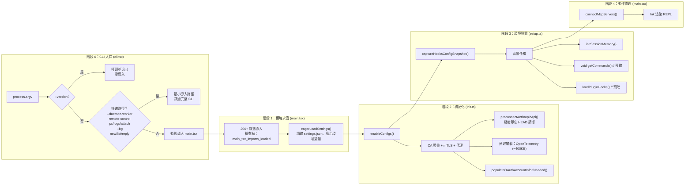

# 第十二集：啟動與引導 —— 從 `claude` 命令到第一個提示符

> **源文件**：`cli.tsx`（303 行）、`init.ts`（341 行）、`setup.ts`（478 行）、`main.tsx`（4,500+ 行）、`bootstrap/state.ts`（1,759 行）、`startupProfiler.ts`（195 行）、`apiPreconnect.ts`（72 行）
>
> **一句話總結**：Claude Code 的啟動是一場精心編排的賽跑 —— 快速路徑級聯、動態導入、並行預取和 API 預連接，一切都是為了讓用戶儘快開始輸入，同時將 400KB+ 的 OpenTelemetry、插件和分析推遲到background。

## 架構概覽



---

## 階段 0：快速路徑級聯

`cli.tsx`（303 行）是真正的入口點。設計原則：**永遠不加載超過需要的內容**。

### 零導入快速路徑

```typescript
// --version：零模塊加載
if (args.length === 1 && (args[0] === '--version' || args[0] === '-v')) {
  console.log(`${MACRO.VERSION} (Claude Code)`)  // 構建時內聯的常量
  return
}
```

`MACRO.VERSION` 在構建時被內聯 —— 無導入、無配置、無磁盤 I/O。

### 快速路徑層級

| 快速路徑 | 觸發條件 | 加載什麼 | 跳過什麼 |
|----------|----------|----------|----------|
| `--version` | `-v`、`--version` | 無 | 一切 |
| `--dump-system-prompt` | Ant 內部標誌 | `config.js`、`prompts.js` | UI、認證、分析 |
| `--daemon-worker` | 監督器生成 | 特定 worker 模塊 | 配置、分析、sink |
| `remote-control` | `rc`、`remote`、`bridge` | Bridge + 認證 + 策略 | 完整 CLI、UI |
| `daemon` | `daemon` 子命令 | 配置 + sink + daemon | 完整 CLI、UI |
| `ps/logs/attach/kill` | background會話管理 | 配置 + bg 模塊 | 完整 CLI、UI |
| `new/list/reply` | 模板 | 模板處理器 | 完整 CLI |
| *(默認)* | 正常啟動 | `main.tsx`（所有內容） | 無 |

每個快速路徑都使用動態 `await import()`，模塊樹僅在該路徑被選中時加載。

### 早期輸入捕獲

```typescript
// 在加載 main.tsx（觸發重量級模塊求值）之前
const { startCapturingEarlyInput } = await import('../utils/earlyInput.js')
startCapturingEarlyInput()
```

在約 500ms 的模塊求值窗口內緩衝按鍵，用戶可以在 REPL 就緒之前就開始輸入。

---

## 階段 1：模塊求值

當 `main.tsx` 加載時，觸發 200+ 個靜態導入的級聯求值。啟動分析器追蹤關鍵里程碑：

```typescript
// main.tsx 頂層
import { profileCheckpoint } from './utils/startupProfiler.js'
profileCheckpoint('main_tsx_entry')  // 重量級導入之前

// ... 200+ 個導入 ...

profileCheckpoint('main_tsx_imports_loaded')  // 所有導入之後
```

### 設置引導

設置必須急切加載，因為它們影響模塊級常量（例如 `DISABLE_BACKGROUND_TASKS` 在 BashTool 導入時被捕獲）。

---

## 階段 2：初始化 (init.ts)

`init()`（341 行，記憶化 —— 只運行一次）處理與信任無關的設置：

### 執行順序

```
1. enableConfigs()                    — 驗證並啟用配置系統
2. applySafeConfigEnvironmentVariables() — 信任對話框之前應用安全環境變量
3. applyExtraCACertsFromConfig()      — 必須在第一次 TLS 握手之前執行
4. setupGracefulShutdown()            — 註冊 SIGINT/SIGTERM 處理器
5. initialize1PEventLogging()         — 延遲：OpenTelemetry sdk-logs
6. populateOAuthAccountInfoIfNeeded() — 異步：填充 OAuth 緩存
7. initJetBrainsDetection()           — 異步：檢測 IDE
8. detectCurrentRepository()          — 異步：填充 git 緩存
9. configureGlobalMTLS()              — mTLS 證書配置
10. configureGlobalAgents()           — HTTP 代理 agent
11. preconnectAnthropicApi()          — 發射即忘 HEAD 請求
12. setShellIfWindows()               — Windows 上檢測 Git-bash
13. ensureScratchpadDir()             — 如果啟用則創建臨時目錄
```

### API 預連接

```typescript
// apiPreconnect.ts — 與啟動工作重疊 TCP+TLS 握手
export function preconnectAnthropicApi(): void {
  // 使用代理/mTLS/unix 套接字時跳過（SDK 使用不同的傳輸通道）
  // 使用 Bedrock/Vertex/Foundry 時跳過（不同的端點）

  const baseUrl = process.env.ANTHROPIC_BASE_URL || getOauthConfig().BASE_API_URL
  // 發射即忘 — 10 秒超時，錯誤靜默捕獲
  void fetch(baseUrl, {
    method: 'HEAD',
    signal: AbortSignal.timeout(10_000),
  }).catch(() => {})
}
```

TCP+TLS 握手消耗約 100-200ms。在 init 期間觸發它，使得預熱的連接在第一次 API 調用時就已就緒。Bun 的 fetch 全局共享 keep-alive 連接池。

### 延遲遙測加載

```typescript
// OpenTelemetry 約 400KB + protobuf 模塊
// gRPC 導出器通過 @grpc/grpc-js 再添加約 700KB
// 全部延遲到遙測實際初始化時
const { initializeTelemetry } = await import('../utils/telemetry/instrumentation.js')
```

---

## 階段 3：環境設置 (setup.ts)

`setup()`（478 行）在信任建立之後運行，處理環境準備：

### 關鍵操作

1. **UDS 消息服務器** — Unix 域套接字進程間通信（`--bare` 時跳過）
2. **Teammate 快照** — 捕獲 Swarm 隊友狀態（`--bare` 時跳過）
3. **終端備份恢復** — 檢測被中斷的 iTerm2/Terminal.app 設置
4. **CWD + 鉤子** — `setCwd()` 必須先運行，然後 `captureHooksConfigSnapshot()`
5. **Worktree 創建** — 如果有 `--worktree`，創建 git worktree 並切換到其中
6. **背景任務** — 發射即忘預取

### 背景預取策略

```typescript
// 背景任務 — 只有關鍵註冊在首次查詢前完成
initSessionMemory()     // 同步 — 註冊鉤子，門控檢查延遲
void getCommands()      // 預取命令（與用戶輸入並行）
void loadPluginHooks()  // 預加載插件鉤子

// 延遲到下一個 tick，git 子進程不阻塞首次渲染
setImmediate(() => {
  void registerAttributionHooks()
})
```

### `--bare` 模式

`--bare` 標誌（內部稱為 "SIMPLE"）短路了大量啟動邏輯：

| `--bare` 時跳過的 | 原因 |
|--------------------|------|
| UDS 消息服務器 | 腳本調用不接收注入消息 |
| Teammate 快照 | bare 模式無 Swarm |
| 終端備份檢查 | 非交互式 |
| 插件預取 | `executeHooks` 在 `--bare` 下提前返回 |
| 歸屬鉤子 | 腳本調用不提交代碼 |
| 會話文件訪問鉤子 | 不需要使用指標 |
| 團隊記憶監視器 | 腳本模式無團隊記憶 |
| 發佈說明 | 非交互式 |

---

## Bootstrap 狀態單例

`bootstrap/state.ts`（1,759 行）是全局狀態存儲 —— 會話級可變狀態存在的**唯一**地方。

### 設計約束

```typescript
// DO NOT ADD MORE STATE HERE - BE JUDICIOUS WITH GLOBAL STATE
// ALSO HERE - THINK THRICE BEFORE MODIFYING
// AND ESPECIALLY HERE
```

代碼中有嚴厲的警告，因為它是依賴圖的葉節點 —— 每個模塊都可以導入它，但它幾乎不導入任何東西。

### 關鍵狀態類別（80+ 個字段）

| 類別 | 示例 | 生命週期 |
|------|------|----------|
| **身份** | `sessionId`、`originalCwd`、`projectRoot` | 會話 |
| **成本追蹤** | `totalCostUSD`、`totalAPIDuration`、`modelUsage` | 會話 |
| **輪次指標** | `turnToolDurationMs`、`turnHookCount` | 每輪（每次查詢重置） |
| **遙測** | `meter`、`sessionCounter`、`loggerProvider` | 延遲初始化 |
| **API 狀態** | `lastAPIRequest`、`lastMainRequestId` | 滾動更新 |
| **緩存鎖存** | `afkModeHeaderLatched`、`fastModeHeaderLatched` | 粘性開啟（永不取消） |
| **功能狀態** | `invokedSkills`、`planSlugCache` | 會話 |

### 緩存保護的粘性鎖存

```typescript
// 一旦 auto mode 被激活，永遠發送該 header
// Shift+Tab 切換不會導致 prompt cache 失效
afkModeHeaderLatched: boolean | null  // null = 尚未觸發, true = 已鎖存

// 一旦 fast mode 被啟用，保持發送 header
// 冷卻進入/退出不會雙重導致緩存失效
fastModeHeaderLatched: boolean | null
```

這些是"粘性開啟" —— 一旦設為 `true`，就永遠不會回到 `false`。這種模式防止了會話中功能切換導致的提示詞緩存失效。

---

## 啟動性能分析器

`startupProfiler.ts`（195 行）為整個啟動路徑提供性能檢測。

### 兩種模式

| 模式 | 觸發方式 | 採樣率 | 輸出 |
|------|----------|--------|------|
| **採樣** | 始終（100% ant，0.5% 外部） | 每會話隨機 | Statsig `tengu_startup_perf` 事件 |
| **詳細** | `CLAUDE_CODE_PROFILE_STARTUP=1` | 100% | 帶內存快照的完整報告到 `~/.claude/startup-perf/` |

### 階段定義

```typescript
const PHASE_DEFINITIONS = {
  import_time: ['cli_entry', 'main_tsx_imports_loaded'],
  init_time: ['init_function_start', 'init_function_end'],
  settings_time: ['eagerLoadSettings_start', 'eagerLoadSettings_end'],
  total_time: ['cli_entry', 'main_after_run'],
}
```

### 檢查點時間線（正常啟動）

```
cli_entry                          →  t=0ms
cli_before_main_import             →  ~5ms（早期輸入緩衝建立）
main_tsx_entry                     →  ~10ms
main_tsx_imports_loaded            →  ~200-500ms（200+ 模塊求值）
eagerLoadSettings_start            →  ~500ms
init_function_start                →  ~525ms
init_network_configured            →  ~540ms（mTLS + 代理）
init_function_end                  →  ~550ms
action_handler_start               →  ~650ms
action_tools_loaded                →  ~700ms
action_after_setup                 →  ~750ms
action_commands_loaded             →  ~800ms
action_mcp_configs_loaded          →  ~850ms
run_before_parse                   →  ~950ms
main_after_run                     →  ~1000ms（REPL 就緒）
```

---

## 可遷移設計模式

> 以下模式可直接應用於其他 CLI 工具或進程引導系統。

### 模式 1：動態導入的快速路徑級聯
**場景：** CLI 工具有約 1 秒的啟動預算，但模塊樹有 200+ 個文件。
**實踐：** 使用動態 `await import()` 創建快速路徑級聯，每條路徑只加載所需模塊。
**Claude Code 中的應用：** `--version` 加載 0 個導入（約 5ms），`--daemon-worker` 加載約 10 個（約 50ms），正常啟動加載 200+（約 500-1000ms）。

### 模式 2：全局狀態的 DAG 葉節點
**場景：** 全局狀態單例如果從模塊樹導入，會導致循環依賴。
**實踐：** 讓狀態模塊成為依賴圖的葉節點——幾乎不導入任何東西，用 lint 規則強制執行。
**Claude Code 中的應用：** `bootstrap/state.ts` 僅導入 `crypto`/`lodash`/`process`；ESLint `bootstrap-isolation` 規則阻止更深層導入。

### 模式 3：預連接 vs 預取
**場景：** 啟動時需要預熱多種資源（網絡、數據），但不能阻塞。
**實踐：** 分離 TCP+TLS 預連接（發射即忘 HEAD）和數據預取（發射即忘異步調用），兩者均非阻塞。
**Claude Code 中的應用：** `preconnectAnthropicApi()` 在首次 API 調用時節省約 100-200ms；`void getCommands()` 並行預取數據。

---

## 組件總結

| 組件 | 行數 | 職責 |
|------|------|------|
| `main.tsx` | 4,500+ | 完整 CLI：commander 設置、動作處理器、REPL 編排 |
| `bootstrap/state.ts` | 1,759 | 全局狀態單例：80+ 字段、DAG 葉節點、粘性鎖存 |
| `setup.ts` | 478 | 信任後環境：worktree、鉤子、背景預取 |
| `init.ts` | 341 | 與信任無關的初始化：配置、TLS、代理、預連接 |
| `cli.tsx` | 303 | 入口點：快速路徑級聯、動態導入分發 |
| `startupProfiler.ts` | 195 | 啟動性能：檢查點、階段、內存快照 |
| `apiPreconnect.ts` | 72 | TCP+TLS 預熱：發射即忘 HEAD 請求到 Anthropic API |

---

*下一篇：[第十三集 — 橋接系統 →](13-bridge-system.md)*

[← 第十一集 — 壓縮系統](11-compact-system.md) | [第十三集 →](13-bridge-system.md)
