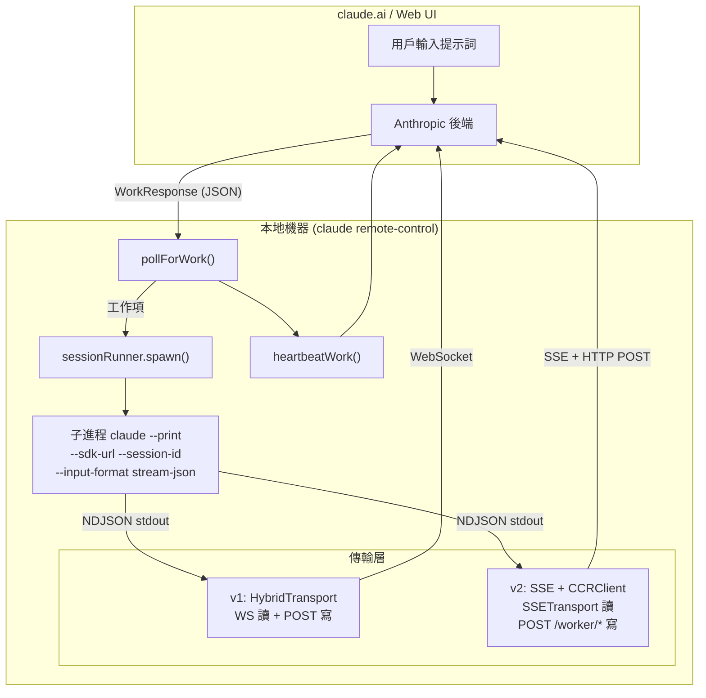

# 第十三集：橋接系統 —— 遠程控制協議

> **源文件**：`bridge/` 目錄 — 31 個文件，總計約 450KB。核心：`bridgeMain.ts`（3,000 行）、`replBridge.ts`（2,407 行）、`remoteBridgeCore.ts`（1,009 行）、`replBridgeTransport.ts`（371 行）、`sessionRunner.ts`（551 行）、`types.ts`（263 行）
>
> **一句話總結**：Bridge 是 Claude Code 的遠程控制線路 —— 一個輪詢-分發-心跳循環，讓用戶在 claude.ai 上輸入、本地機器執行代碼，支持兩代傳輸協議（v1 WebSocket/POST，v2 SSE/CCRClient）、崩潰恢復指針、JWT 刷新調度和 32 會話容量管理。

## 架構概覽



---

## 兩種橋接模式

### 1. 獨立橋接（`claude remote-control`）

`bridgeMain.ts`（3,000 行）—— 長期運行的服務器模式：

```
用戶運行：claude remote-control
→ registerBridgeEnvironment() → 獲取 environment_id + secret
→ 輪詢循環：每 N 毫秒 pollForWork()
→ 收到工作：生成子進程 `claude --print --sdk-url ...`
→ 子進程流式輸出 NDJSON → 橋接轉發到服務器
→ 完成時：stopWork() → 歸檔會話 → 返回輪詢
```

**生成模式：**

| 模式 | 標誌 | 行為 |
|------|------|------|
| `single-session` | （默認） | 單會話，會話結束時橋接退出 |
| `worktree` | `--worktree` | 每個會話獲得隔離的 git worktree |
| `same-dir` | `--spawn`、`--capacity` | 所有會話共享 cwd |

**多會話容量：**最多 32 個併發會話（`SPAWN_SESSIONS_DEFAULT = 32`），由 `tengu_ccr_bridge_multi_session` 門控。

### 2. REPL 橋接（交互模式中的 `/remote-control` 命令）

`replBridge.ts`（2,407 行）—— 進程內橋接用於交互會話：

```
用戶在 REPL 中輸入 /remote-control
→ initBridgeCore() → 註冊環境 → 創建會話
→ 輪詢循環：等待 web 用戶輸入
→ 通過傳輸層雙向轉發消息
→ 歷史刷新：將現有對話發送到 web UI
```

---

## 傳輸協議演進

### v1：HybridTransport（WebSocket + POST）

```typescript
// Session-Ingress 層
// 讀取：WebSocket 連接到 session-ingress URL
// 寫入：HTTP POST 到 session-ingress URL
// 認證：OAuth 訪問令牌
```

### v2：SSE + CCRClient

```typescript
// CCR（Claude Code Runtime）層
// 讀取：SSETransport → GET /worker/events/stream
// 寫入：CCRClient → POST /worker/events (SerialBatchEventUploader)
// 認證：帶 session_id 聲明的 JWT（不是 OAuth）
// 心跳：PUT /worker（CCRClient 內置，默認 20 秒）
```

v2 新增：
- **Worker 註冊**：`registerWorker()` → 服務器分配 epoch 號
- **基於 Epoch 的衝突解決**：舊 epoch 返回 409 → 關閉傳輸，重新輪詢
- **投遞跟蹤**：`reportDelivery('received' | 'processing' | 'processed')`
- **狀態報告**：`reportState('running' | 'idle' | 'requires_action')`

### v3：無環境橋接（`remoteBridgeCore.ts`）

```typescript
// 直接 OAuth → worker_jwt 交換，無 Environments API
// 1. POST /v1/code/sessions → session.id
// 2. POST /v1/code/sessions/{id}/bridge → {worker_jwt, expires_in, worker_epoch}
// 3. createV2ReplTransport → SSE + CCRClient
// 無 register/poll/ack/stop/heartbeat/deregister 生命週期
```

由 `tengu_bridge_repl_v2` 門控。為 REPL 會話消除了整個輪詢-分發層。

---

## 輪詢-分發循環

`bridgeMain.ts` 實現了精密的工作輪詢循環：

### 輪詢間隔配置（GrowthBook 驅動）

```typescript
// 通過 GrowthBook 實時可調（每 5 分鐘刷新）
const pollConfig = getPollIntervalConfig()
// 間隔：
//   not_at_capacity：快速輪詢獲取新工作
//   partial_capacity：中等輪詢（部分會話活躍）
//   at_capacity：慢速/僅心跳（所有槽位已滿）
```

### 錯誤恢復

```typescript
const DEFAULT_BACKOFF: BackoffConfig = {
  connInitialMs: 2_000,
  connCapMs: 120_000,      // 最大退避 2 分鐘
  connGiveUpMs: 600_000,   // 10 分鐘後放棄
  generalInitialMs: 500,
  generalCapMs: 30_000,
  generalGiveUpMs: 600_000,
}
```

橋接區分連接錯誤（網絡斷開）和一般錯誤（服務器 500），對兩者應用獨立的指數退避和放棄計時器。

---

## 會話運行器

`sessionRunner.ts`（551 行）封裝子進程管理：

```typescript
// 子進程生成命令：
claude --print \
  --sdk-url <session_url> \
  --session-id <id> \
  --input-format stream-json \
  --output-format stream-json \
  --replay-user-messages
```

### 活動跟蹤

橋接解析子進程 stdout 的 NDJSON 以提取實時活動摘要：

```typescript
const TOOL_VERBS = {
  Read: 'Reading', Write: 'Writing', Edit: 'Editing',
  Bash: 'Running', Glob: 'Searching', WebFetch: 'Fetching',
}
```

### 通過 Stdin 刷新令牌

```typescript
// 通過 stdin 向子進程發送新 JWT
handle.writeStdin(JSON.stringify({
  type: 'update_environment_variables',
  variables: { CLAUDE_CODE_SESSION_ACCESS_TOKEN: token },
}) + '\n')
```

子進程的 StructuredIO 處理 `update_environment_variables`，直接設置 `process.env`。

---

## JWT 生命週期與崩潰恢復

### 令牌刷新調度

```typescript
const tokenRefresh = createTokenRefreshScheduler({
  refreshBufferMs: 5 * 60_000,  // 過期前 5 分鐘
  onRefresh: (sessionId, oauthToken) => {
    // v1：直接將 OAuth 令牌傳遞給子進程
    // v2：調用 reconnectSession() 觸發服務器重新分發
  },
})
```

v2 中每次 `/bridge` 調用都會遞增服務器端 epoch。僅交換 JWT 會導致舊 CCRClient 使用過期 epoch 心跳（→ 20 秒內 409），因此必須重建整個傳輸層。

### 崩潰恢復指針

```typescript
// 會話創建後寫入（崩潰恢復線索）
await writeBridgePointer(dir, {
  sessionId, environmentId, source: 'repl',
})
// 正常拆除時清除（永久模式除外）
```

重啟時的恢復策略：
1. **策略 1**：使用 `reuseEnvironmentId` 冪等重新註冊 → 如果返回相同 env，`reconnectSession()` 重新排隊現有會話
2. **策略 2**：如果 env 過期（筆記本休眠 >4h），歸檔舊會話 → 在新環境上創建新會話

---

## 權限管道

當子 CLI 需要工具批准時：

```
子進程 stdout → { type: 'control_request', subtype: 'can_use_tool' }
→ 橋接通過傳輸層轉發 → 服務器 → claude.ai 顯示批准 UI
→ 用戶點擊批准/拒絕
→ 服務器發送 control_response → 橋接傳輸 → 子進程 stdin
→ reportState('running') // 清除"等待輸入"指示器
```

---

## 可遷移設計模式

> 以下模式可直接應用於其他遠程控制或分佈式智能體系統。

### 模式 1：基於 Epoch 的衝突解決
**場景：** 重連後多個 worker 可能競爭同一會話。
**實踐：** 註冊時分配單調遞增的 epoch；對過期 epoch 的請求返回 409。
**Claude Code 中的應用：** v2 傳輸使用 `worker_epoch`——409 觸發傳輸拆除和重新輪詢。

### 模式 2：CapacityWake（基於 AbortController 的休眠中斷）
**場景：** 橋接在容量滿時休眠，但需要在空位出現時立即響應。
**實踐：** 使用 `AbortController` 信號中斷休眠計時器。
**Claude Code 中的應用：** `capacityWake.wake()` 中斷輪詢休眠，橋接立即接受新工作。

### 模式 3：回調注入實現 Bootstrap 隔離
**場景：** 子系統（橋接）必須避免導入主模塊樹以保持包體積小。
**實踐：** 將依賴作為回調注入，而非直接導入。
**Claude Code 中的應用：** `createSession` 注入為 `(opts) => Promise<string | null>`，避免將整個 REPL 樹拉入 Agent SDK 包。

---

## 組件總結

| 組件 | 行數 | 職責 |
|------|------|------|
| `bridgeMain.ts` | 3,000 | 獨立橋接：輪詢循環、多會話、worktree、退避 |
| `replBridge.ts` | 2,407 | REPL 橋接：環境註冊、會話創建、傳輸管理 |
| `remoteBridgeCore.ts` | 1,009 | 無環境橋接：直接 OAuth→JWT，無輪詢-分發層 |
| `sessionRunner.ts` | 551 | 子進程生成、NDJSON 解析、活動跟蹤 |
| `replBridgeTransport.ts` | 371 | 傳輸抽象：v1 (WS+POST) vs v2 (SSE+CCRClient) |
| `types.ts` | 263 | 協議類型：WorkResponse、SessionHandle、BridgeConfig |

**橋接系統總計：約 11,700 行協議編排代碼。**

---

[← 第十二集 — 啟動與引導](12-startup-bootstrap.md) · [第十四集 — UI 與狀態管理 →](14-ui-state-management.md)
